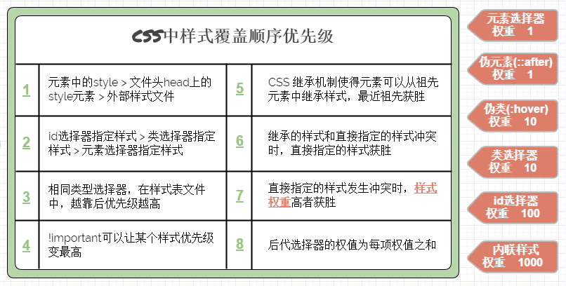
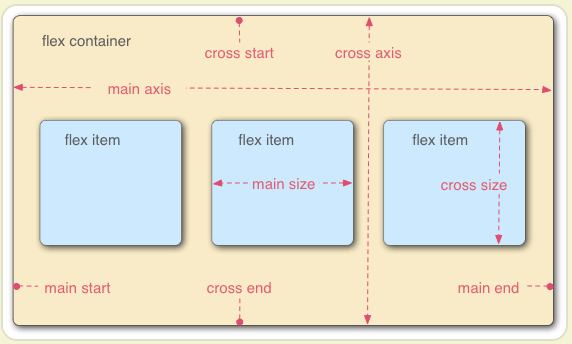
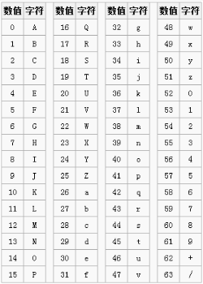
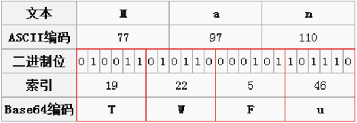
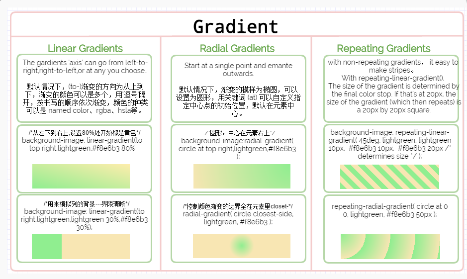
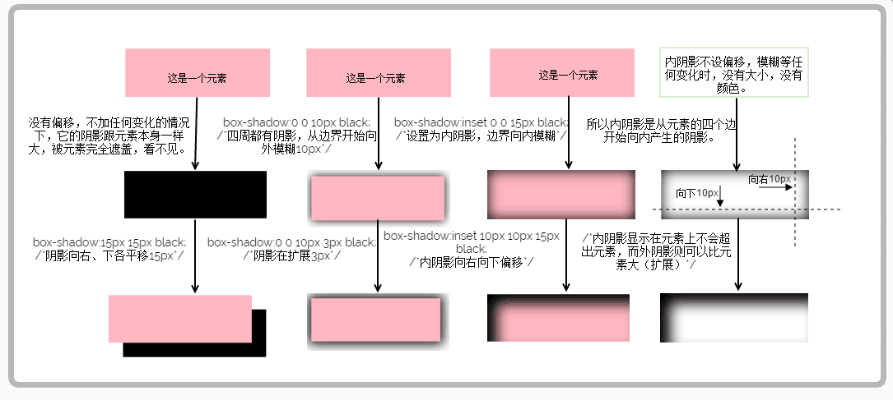

### CSS

1. 圣杯布局的原理和实现、双飞翼。

  答案：圣杯布局是一种非常经典和常用的布局方式，其所指的是三列布局，中间宽度自适应，两边定宽；或者两列布局，主体宽度自适应，左边或右边定宽。

  圣杯布局：用到浮动、负边距、相对定位，不添加额外标签
  

  1、中间部分需要根据浏览器宽度的变化而变化，所以要用100%，(这里设置的center 的宽度为了100%不包括padding)这里设左中右向左浮动，因为中间100%，左层和右层根本没有位置上去。此处html结构中中间部分要先写。

  2、用css控制各块到各自位置上。简单的办法是使用负margin。负margin的原理是盒子模型的算法`内容+padding+border+margin `想一下这个公式里如果有一个负值，总和会怎么变，占据宽度空间会怎么变。把左层负margin150后，发现left上去了，因为负到出窗口没位置了，只能往上挪。那么按这个方法，可以得出它只要挪动窗口宽度那么宽就能到最左边了，利用负边距，把左右栏定位。

  3、俩侧边栏虽已经和中间主题内容处于同一行，但是肯定不能遮挡要平移到对应位置上。直接给父元素加个padding。

  4、但是加了之后左右栏也缩进来了，于是采用相对定位方法，俩侧边栏移到padding区域就搞定了。(position为static时，left设置没用，left：20px表示距离父元素的左边20px)

  ```html
  <body>
      <div class="header">头部</div>
      <div class="container">   
        <div class="main">主内容栏自适应宽度</div>
        <div class="left">侧边栏1固定宽度</div>
        <div class="right">侧边栏2固定宽度</div>
      </div>
      <div class="footer">底部</div>
  </body>
  ```
  ```css
  body{
    padding:0;
    margin:0
  }
  .header,.footer{
    width:100%;  
    background: #666;
    height:30px;clear:both;
    text-align :center
  }
  .container{
    padding-left:150px;
    padding-right:190px;
    text-align :center
  }
  .left{
    background: #E79F6D;
    width:150px;
    float:left;
    margin-left:-100%;
    position: relative;
    left:-150px;
  }
  .main{
     background: #D6D6D6;
     width:100%;
     float:left;

  }
  .right{
     background: #77BBDD;
     width:190px;
     float:left;
     margin-left:-190px;
     position:relative;
     right:-190px;
   }
  ```
  双飞翼布局就是不使用相对布局，将中间主内容在使用一个`div class="mid"`包裹起来，仅使用浮动和负margin实现圣杯布局。
  ```html
  <body>
      <div class="header">头部</div>
      <div class="container">  
        <div class = "main">
          <div class="mid">主内容栏自适应宽度</div>
        </div>
        <div class="left">侧边栏1固定宽度</div>
        <div class="right">侧边栏2固定宽度</div>
      </div>
      <div class="footer">底部</div>
  </body>
  ```
  ```css
  .container{
    text-align :center
  }
  .main .mid{
  margin-left:150px;
  margin-right:190px;
  }
  .main{
  background: #D6D6D6;
  width:100%;
  float:left;
  }  
  .left{
    background: #E79F6D;
    width:150px;
    float:left;
    margin-left:-100%;
  }
  .right{
     background: #77BBDD;
     width:190px;
     float:left;
     margin-left:-190px;
  }
  ```

  参考：

   - [圣杯布局的实现过程](http://www.cnblogs.com/wuguoyuan/p/grail.html)

2. 盒子模型。

  答案：针对块级元素说的,把块级元素想像成一个装东西的盒子，而margin,padding,border,width这些css属性构成了盒模式。浏览器的盒子模型指的是它的盒子宽度需要包括内容区宽度、内外边距和边框大小，高度类似。一般设置宽度默认是对应内容区宽度。CSS设置的宽度仅仅是内容区的宽度，而非盒子的宽度,盒子的宽度=padding + border + width，实际呈现的盒子的宽度可能会大于我们设置的宽度（除非没有左右边框和左右补白）。

  兼容性方面：在IE7以前的版本中设置宽度是包括：内边距+边框+内容区的。IE7之后跟其它浏览器一样，都是只对应内容区的宽度。可以通过修改box-sizing:border-box来修改。让设置宽度等于内容区和边框和内边距之和。
  

3. 如何通过`CSS`改变盒子模型的布局？

  答案：**box-sizing让CSS布局更加直观**

  人们慢慢的意识到传统的盒子模型不直接，当我们希望页面呈现的盒子的宽度是200px的时候，我们需要减去它的左右边框和左右补白，然后设置为对应的CSS宽度。例如，我们设置希望盒子宽度为200px，则需要先减去左右补白各20px，左右边框各1px，然后设置对应的CSS宽度158px。

  所以他们新增了一个叫做 box-sizing 的CSS属性。当你设置一个元素为 box-sizing: border-box; 后。例如我们想要一个宽度为200px的盒子，那么我们直接设置宽度为200px。当再设置它的左右边框和左右补白后，它的内容区会自动调整。这可能更直接和一目了然。此元素的内边距和边框不再会增加它的宽度。它是支持IE8+的,Firefox 需要加上浏览器厂商前缀-moz-，对于低版本的IOS和Android浏览器也需要加上-webkit-。
  ```css
  * {
    -webkit-box-sizing: border-box;
       -moz-box-sizing: border-box;
            box-sizing: border-box;
  }
  div {
    box-sizing: border-box;
    width: 200px;
    padding: 20px;
    border: 1px solid #DDD;
  }
  ```
  

  * box-sizing同样可以设置为content-box，这样设置CSS的宽度的时候仅仅是设置的它的内容区的宽度，浏览器默认都是如此。
  * box-sizing也可以设置为inherit，也就是说从父级元素中继承该属性。
  参考：

   - [让CSS布局更加直观：box-sizing](http://www.cnblogs.com/front-Thinking/p/4394901.html)
   - [学习CSS布局](http://zh.learnlayout.com/box-sizing.html)

4. `CSS`几种定位方式的概念和区别。

  答案：
  1. css文档流

    将窗体自上而下分成一行行，并在每一行中从左到右的顺序排放元素，即为文档流。有三种情况将使得元素脱离文档流，分别是浮动(float left or right)、绝对定位(position:absolute)、固定定位(position:fixed)。
  2. 何为css定位

    CSS定位，就是元素的position不为static。而该元素将成为其亲子元素的offsetParent，也有机会成为其孙元素的offsetParent。
  3. position各属性值详解

    [1].static：默认值，元素将按照正常文档流规则排列；

    [2].relative：相对定位，元素仍然处于正常文档流当中，但可以通过left、top、right和bottom的CSS规则来改变元素的位置。注意：
      * 元素原来位置将保留，不被其他元素所占据;
      * 当使用left，top改变元素位置时，元素将以原来位置的border外边框的左上角作为参考点 ;

    [3].absolute：绝对定位，元素脱离正常文档流，可通过left、top、right和bottom的CSS规则来改变元素的位置。注意：
      *  元素将不再占据原有位置;
      * 当元素的offsetParent为body而且body没有进行CSS定位，则参考点为页面;其他情况，参考点为offsetParent的padding外边框。

    [4].fixed：固定定位，元素脱离正常文档流，可通过left、top、right和bottom的CSS规则来改变元素的位置。注意：
      *  元素将不再占据原有位置;
      *  以浏览器的可视区域的四角作为参考点；
      *  IE5.5~6不支持该属性值。

    当你想在页面的某个区域始终存在（浮动）一个网页元素，比如一个DIV，你希望它能始终浮动在窗口的某个位置（比如页面两侧）。在IE7以上的浏览器以及标准浏览器，都支持一个属性 position:fixed ，可以很简单地实现想要的效果，而且当窗口滚动时，该元素的滚动也会很平滑。。。但是在IE6及以下的版本浏览器下，并不支持该属性，所以只好使用position:absolute来代替实现，但新问题出现，你会发现，当滚动窗口时，该元素会出现抖动的现象，看起来就很不舒服，为了去掉这个抖动的BUG，为了实现平滑滚动，就有了以下这个css代码。
    ```css
    * html{
           background-image:url(about:blank);
           background-attachment:fixed;
    }
    ```
      *注释：*`*html`是ie7的hack,hack就是一些不标准的写法，奇技淫巧，一般是为了解决浏览器不兼容的问题，也有其他的，不过随着大厂商对IE6，7，8的抛弃，这些基本已经成为历史了。JS也有hack，不过因为jquery的存在，jquery帮我们解决了，jquery屏蔽了浏览器的差异，提供给我们一个统一的接口，jquery源码有很多hack，css如果用sass,less这些css处理器也可以达到这个效果，按照标准的写，自动生成兼容不同浏览器的css。sass,less的其他优点包括：对于大型项目易于维护；可以让CSS的开发变得简单和可维护；提高开发效率。等。

  **注意的是定位的参照：** relative参照于自己该出现的位置，而absolute参照于祖先元素中与自己最近的已定位元素(relative或者absolute)直到body元素。

  参考：

   - [Position定位详解](http://www.cnblogs.com/fsjohnhuang/p/3967350.html)
5. `CSS`实现动画有几种方式(简单动画的实现，如旋转等)？

  答案：依靠CSS3中提出的三个属性：transition、transform、animation。**CSS3的animation类似于transition属性，他们都是随着时间改变元素的属性值。他们主要区别是transition需要触发一个事件(hover事件或click事件等)才会随时间改变其css属性；而animation在不需要触发任何事件的情况下也可以显式的随着时间变化来改变元素css的属性值，从而达到一种动画的效果**

  * transition(转换)：

    >css的transition允许css的属性值在一定的时间区间内平滑地过渡。这种效果可以在鼠标单击、获得焦点、被点击或对元素任何改变中触发，并圆滑地以动画效果改变CSS的属性值。

    ```css
    transition: <property> <duration> <animation type> <delay>
    p {
      -webkit-transition: all .5s ease-in-out 1s;/*Webkit内核*/
      -o-transition: all .5s ease-in-out 1s;/*Opera*/
      -moz-transition: all .5s ease-in-out 1s;/*Mozilla内核*/
      transition: all .5s ease-in-out 1s;/*W3C 标准*/
    }
    ```
    transition主要包含四个属性值：
    执行变换的属性：transition-property是用来指定当元素其中一个属性改变时执行transition效果，其主要有以下几个值：none(没有属性改变)；all（所有属性改变）这个也是其默认值；indent（元素属性名）;
    变换延续的时间：transition-duration:单位为s（秒）或者ms(毫秒),可以作用于所有元素，包括:before和:after伪元素。其默认值是0，也就是变换时是即时的;
    在延续时间段，变换的速率变化transition-timing-function:ease、linear、ease-in(加速)、ease-out、ease-in-out、cubic-bezier；
    变换延迟时间transition-delay：指定一个动画开始执行的时间。

    有时我们不只改变一个css效果的属性,而是想改变两个或者多个css属性的transition效果，那么我们只要把几个transition的声明串在一起，用逗号（“，”）隔开，然后各自可以有各自不同的延续时间和其时间的速率变换方式。
  * transform(变形)：定义元素的变化结果，旋转rotate、扭曲skew、缩放scale和移动translate以及矩阵变形matrix。

    ```css
    transform ： none | <transform-function> [ <transform-function> ]*
    transform:rotate(30deg):/*设置的值为正数表示顺时针旋转，如果设置的值为负数，则表示逆时针旋转。/*/
    transform:translate(100px,20px):/*translateX(X)仅水平方向移动（X轴移动）;translateY/*/
    transform:scale(2,1.5):/*scaleX(x)表示元素只在X轴(水平方向)缩放元素*/
    transform:skew(30deg,10deg):/*skewX(y)是使元素以其中心为基点，并在水平方向（X轴）进行扭曲变行， */
    ```
    ```css
    /*<div id="transDiv" class="transStart"> transition </div>  id 为“transDiv”的 div，当它的初始“background-color”属性变化时（被 JavaScript 修改），会呈现出一种变化效果，持续时间为 0.3 秒，效果为均匀变换（linear）。如：该 div 的 class 属性由“transStart”改为“transEnd”，其背景会由白（white）渐变到红（red）*/  
    .transStart {
       background-color: white;
       -webkit-transition: background-color 0.3s linear;
       -moz-transition: background-color 0.3s linear;
       -o-transition: background-color 0.3s linear;
       transition: background-color 0.3s linear;
    }
    .transEnd {
       background-color: red;
    }
    ```
    none:表示不进么变换；<transform-function>表示一个或多个变换函数，以空格分开；换句话说就是我们同时对一个元素进行transform的多种属性操作，它可用于内联(inline)元素和块级(block)元素。它允许我们旋转、缩放和移动元素，transform用使用多个属性叠加效果时用空格隔开。
  * animation(动画)：动画定义了动作的每一帧（@keyframes）有什么效果，包括animation-name，animation-duration、animation-timing-function、animation-delay、animation-iteration-count、animation-direction。
  DEMO: 发光的灯泡
  ```html
  <a href="" class="btn">发光的button</a>
  ```
  ```css
  /*给这个按钮创建一个动名名称：buttonLight，然后在每个时间段设置不同的background,color来达到变色效果，改变box-shadow来达到发光效果*/
  /*Keyframes具有其自己的语法规则，他的命名是由"@keyframes"开头，后面紧接着是这个“动画的名称”加上一对花括号“{}”，括号中就是一些不同时间段样式规则，有点像我们css的样式写法一样。keyframes的单位只接受百分比值*/
  @-webkit-keyframes 'buttonLight' {
      from {
        background: rgba(96, 203, 27,0.5);
        -webkit-box-shadow: 0 0 5px rgba(255, 255, 255, 0.3) inset, 0 0 3px rgba(220, 120, 200, 0.5);
        color: red;
      }
      25% {
        background: rgba(196, 203, 27,0.8);
        -webkit-box-shadow: 0 0 10px rgba(255, 155, 255, 0.5) inset, 0 0 8px rgba(120, 120, 200, 0.8);
        color: blue;
     }
     50% {
       background: rgba(196, 203, 127,1);
       -webkit-box-shadow: 0 0 5px rgba(155, 255, 255, 0.3) inset, 0 0 3px rgba(220, 120, 100, 1);
       color: orange;
     }
     75% {
       background: rgba(196, 203, 27,0.8);
       -webkit-box-shadow: 0 0 10px rgba(255, 155, 255, 0.5) inset, 0 0 8px rgba(120, 120, 200, 0.8);
       color: black;
     }
    to {
      background: rgba(96, 203, 27,0.5);
      -webkit-box-shadow: 0 0 5px rgba(255, 255, 255, 0.3) inset, 0 0 3px rgba(220, 120, 200, 0.5);
      color: green;
     }
   }
   a.btn {
     /*按钮的基本属性*/
     background: #60cb1b;
     font-size: 16px;
     padding: 10px 15px;
     color: #fff;
     text-align: center;
     text-decoration: none;
     font-weight: bold;
     text-shadow: 0 -1px 1px rgba(0,0,0,0.3);
     -moz-border-radius: 5px;
     -webkit-border-radius: 5px;
     border-radius: 5px;
     -moz-box-shadow: 0 0 5px rgba(255, 255, 255, 0.6) inset, 0 0 3px rgba(220, 120, 200, 0.8);
     -webkit-box-shadow: 0 0 5px rgba(255, 255, 255, 0.6) inset, 0 0 3px rgba(220, 120, 200, 0.8);
     box-shadow: 0 0 5px rgba(255, 255, 255, 0.6) inset, 0 0 3px rgba(220, 120, 200, 0.8);
     /*调用animation属性，从而让按钮在载入页面时就具有动画效果*/
     -webkit-animation-name: "buttonLight"; /*动画名称，需要跟@keyframes定义的名称一致*/
     -webkit-animation-duration: 5s;/*动画持续的时间长*/
     -webkit-animation-iteration-count: infinite;/*动画循环播放的次数*/
   }
  ```

  参考：

   - [CSS3 Transition](http://www.w3cplus.com/content/css3-transition)
   - [CSS3 Transform](http://www.w3cplus.com/content/css3-transform)
   - [CSS3 Animation](http://www.w3cplus.com/content/css3-animation)

6. `CSS`不同选择器的权重(CSS层叠的规则)。

  答案：首先，找出所有应用到该标签的所有规则。然后按照下面的规则进行应用：
  1. ！important规则最重要，大于其它规则；
  2. 行内样式规则，加1000；
  3. 对于选择器中给定的各个ID属性值，加100；
  4. 对于选择器中给定的各个类属性、属性选择器或者伪类选择器，加10；
  5. 对于选择其中给定的各个元素标签选择器，加1；
  6. 通配符和结合符给予特殊性没有任何贡献；
  7. 如果权值一样，则按照样式规则的先后顺序来应用，顺序靠后的覆盖靠前的规则。

  ```css
  *             {}  /* a=0 b=0 c=0 d=0 -> specificity = 0,0,0,0 */
  li            {}  /* a=0 b=0 c=0 d=1 -> specificity = 0,0,0,1 */
  li:first-line {}  /* a=0 b=0 c=0 d=2 -> specificity = 0,0,0,2 */
  ul li         {}  /* a=0 b=0 c=0 d=2 -> specificity = 0,0,0,2 */
  ul ol+li      {}  /* a=0 b=0 c=0 d=3 -> specificity = 0,0,0,3 */
  h1 + *[rel=up]{}  /* a=0 b=0 c=1 d=1 -> specificity = 0,0,1,1 */
  ul ol li.red  {}  /* a=0 b=0 c=1 d=3 -> specificity = 0,0,1,3 */
  li.red.level  {}  /* a=0 b=0 c=2 d=1 -> specificity = 0,0,2,1 */
  #x34y         {}  /* a=0 b=1 c=0 d=0 -> specificity = 0,1,0,0 */
  style=""          /* a=1 b=0 c=0 d=0 -> specificity = 1,0,0,0 */
  ```
  

7. ·`flexbox`布局的基本原理和用法。

  答案：网页布局（layout）是CSS的一个重点应用。布局的传统解决方案，基于盒状模型，依赖 display属性 + position属性 + float属性。它对于那些特殊布局非常不方便，比如，垂直居中就不容易实现。Flex是Flexible Box的缩写，意为"弹性布局"，用来为盒状模型提供最大的灵活性。Flex布局，可以简便、完整、响应式地实现各种页面布局。任何一个容器都可以指定为Flex布局。行内元素也可以使用Flex布局。Webkit内核的浏览器，必须加上-webkit前缀。**注意**，设为Flex布局以后，子元素的float、clear和vertical-align属性将失效。

  ```css
  .box{display: flex;}
  .box{display: inline-flex;}
  .box{
    display: -webkit-flex; /* Safari */
    display: flex;
  }
  ```
  简单描述一下flex的属性，细节可以参考链接文档.采用Flex布局的元素，称为Flex容器（flex container），简称"容器"。它的所有子元素自动成为容器成员，称为Flex项目（flex item），简称"项目"。容器默认存在两根轴：水平的主轴（main axis）和垂直的交叉轴（cross axis）。主轴的开始位置（与边框的交叉点）叫做main start，结束位置叫做main end；交叉轴的开始位置叫做cross start，结束位置叫做cross end。项目默认沿主轴排列。单个项目占据的主轴空间叫做main size，占据的交叉轴空间叫做cross size。

  

  1. 容器属性（采用Flex布局的元素，container）：

    * flex-direction：决定主轴的方向（即项目的排列方向）；row (默认，水平，左->右)| row-reverse(水平，右->左) | column (垂直，上->下)| column-reverse(垂直，下->上);
    * flex-wrap：设置如果一条轴线排不下，如何换行；nowrap(你，不换行) | wrap(换行，第一行在上) | wrap-reverse(换行，第一行在下)
    * flex-flow：flex-direction属性和flex-wrap属性的简写形式，flex-direction || flex-wrap
    * justify-content：定义了项目在主轴上的对齐方式；flex-start(默认，左对齐) | flex-end(右对齐) | center(居中) | space-between(两端对齐，项目之间的间隔都相等) | space-around(每个项目两侧的间隔相等。所以，项目之间的间隔比项目与边框的间隔大一倍)
    * align-items：定义项目在交叉轴上如何对齐；flex-start | flex-end | center | baseline(项目的第一行文字的基线对齐) | stretch(默认，如果项目未设置高度或设为auto，将占满整个容器的高度)
    * align-content：定义了多根轴线的对齐方式；flex-start | flex-end | center | space-between | space-around | stretch
  2. 项目属性（子元素为项目，item）

    * order：定义项目的排列顺序。数值越小，排列越靠前，默认为0。
    * flex-grow：定义项目的放大比例，默认为0，即如果存在剩余空间，也不放大。
    * flex-shrink：定义了项目的缩小比例，默认为1，即如果空间不足，该项目将缩小。（如果一个项目的flex-shrink属性为0，其他项目都为1，则空间不足时，前者不缩小。）
    * flex-basis：定义了在分配多余空间之前，项目占据的主轴空间。它的默认值为auto，即项目的本来大小
    * flex：flex-grow, flex-shrink 和 flex-basis的简写。(auto (1 1 auto) 和 none (0 0 auto)。)
    * align-self：允许单个项目有与其他项目不一样的对齐方式，可覆盖align-items属性。

  **圣杯布局、基本网络布局、骰子布局、输入框布局、悬挂式布局、固定底栏布局、流式布局** 都可以用flex布局实现在链接中！亲手写一遍！

  

  ```css
  * {box-sizing: border-box;}
  [class$="face"] {
  margin: 16px;
  padding: 4px;
  background-color: #e7e7e7;
  width: 104px;
  height: 104px;
  object-fit: contain;
  box-shadow:
    inset 0 5px white,
    inset 0 -5px #bbb,
    inset 5px 0 #d7d7d7,
    inset -5px 0 #d7d7d7;
  border-radius: 10%;
  }
  .pip {
  display: block;
  width: 24px;
  height: 24px;
  border-radius: 50%;
  margin: 4px;
  background-color: #333;
  box-shadow: inset 0 3px #111, inset 0 -3px #555;
  }
  .third-face {
    display: flex;
    justify-content: space-between;
  }
  .third-face .pip:nth-of-type(2) {
    align-self: center;
  }
  .third-face .pip:nth-of-type(3) {
    align-self: flex-end;
  }
  .fifth-face {
    display: flex;
    justify-content: space-between;
  }
  .fifth-face .column {
    display: flex;
    flex-direction: column;
    justify-content: space-between;
  }
  .fifth-face .column:nth-of-type(2) {
    justify-content: center;
  }
  ```
  ```html
  <div class="third-face">
    <span class="pip"></span>
    <span class="pip"></span>
    <span class="pip"></span>
  </div>
  </div>
  <div class="fifth-face">
    <div class="column">
      <span class="pip"></span>
      <span class="pip"></span>
    </div>
    <div class="column">
      <span class="pip"></span>
    </div>
    <div class="column">
      <span class="pip"></span>
      <span class="pip"></span>
    </div>
  </div>
  ```
  参考：

     - [Flex 布局教程：语法篇](http://www.ruanyifeng.com/blog/2015/07/flex-grammar.html)
     - [Flex 布局教程：实例篇](http://www.ruanyifeng.com/blog/2015/07/flex-examples.html)

8. 块级元素和行内元素的区别？

  答案：块级元素：header/p/div/form/table/footer....；行内元素：span/a/strong/em/input...(内联元素 display:inline 也叫行内元素)

   1.块级元素独占一行，可以设置宽高以及边距，行内元素不会独占一行，设置宽高行距等不会起效；

   2.块级元素可以包含块级元素和行内元素，行内元素只能包含行内元素，不能包含块级元素；

   3.行内元素设置width、height、margin的上下、padding的上下无效；

   4.行内元素可以通过设置display：block，渲染为块级元素。

9. 浮动的原理。

  答案：float 属性定义元素在哪个方向浮动。以往这个属性总应用于图像，使文本围绕在图像周围，不过在 CSS 中，任何元素都可以浮动。浮动元素会生成一个块级框，而不论它本身是何种元素。`float:right|left|none|inherit`

  浮动的框可以向左或向右移动，直到它的外边缘碰到包含它的框或另一个浮动块的边框为止。由于浮动框不在文档的普通流中，所以文档的普通流中的块框表现得就像浮动框不存在一样。浮动框旁边的行框被缩短，从而给浮动框留出空间，行框围绕浮动框。因此，创建浮动框可以使文本围绕图像。当一个元素浮动之后，不会影响到块级框的布局而只会影响内联框（通常是文本）的排列。

  浮动出现的意义其实只是用来让文字环绕图片。图片本身一个inline boxes，图片与文字基线对齐，图片与文字在同一行上。浮动破坏了正常的line boxes，由于浮动元素没有了inline boxes，没有了inline boxes高度，才能让其他inline boxes元素重新整合，环绕浮动元素排列。“包裹与破坏”(inlinebox叠加成linebox的高度,**行框与行内框**(见印象笔记))

  顾名思义，就是漂浮于普通流之上，像浮云一样，但是只能左右浮动。给元素的float属性赋值后，就是脱离文档流，进行左右浮动，紧贴着父元素(默认为body文本区域)的左右边框。浮动元素在文档流空出的位置，由后续的(非浮动)元素填充上去：块级元素直接填充上去，若跟浮动元素的范围发生重叠，浮动元素覆盖块级元素。浮动会覆盖块级元素。内联元素：有空隙就插入。环绕浮动元素，并不会被覆盖。

  参考：

     - [CSS float浮动的深入研究、详解及拓展(一)](http://www.zhangxinxu.com/wordpress/2010/01/css-float%E6%B5%AE%E5%8A%A8%E7%9A%84%E6%B7%B1%E5%85%A5%E7%A0%94%E7%A9%B6%E3%80%81%E8%AF%A6%E8%A7%A3%E5%8F%8A%E6%8B%93%E5%B1%95%E4%B8%80/)

10. 清除浮动有哪几种方式以及它们的优缺点？

  答案：通过浮动，我们能很方便地布局,但有带来很多的问题需要解决。文档中的普通流就会表现得和浮动框不存在一样，如果包含框太窄，无法容纳水平排列的三个浮动元素，那么其它浮动块向下移动，直到有足够的空间。如果浮动元素的高度不同，那么当它们向下移动时可能被其它浮动元素“卡住”。当浮动框高度超出包含框的时候，也就会出现包含框不会自动伸高来闭合浮动元素（“高度塌陷”现象）。**元素含有浮动属性 – 破坏inline box – 破坏line box高度 – 没有高度 – 塌陷**

  正是因为浮动的这种特性，导致本属于普通流中的元素浮动之后，包含框内部由于不存在其他普通流元素了，也就表现出高度为0（高度塌陷：父元素只包含浮动元素,且父元素未设置高度和宽度的时候）。在实际布局中，往往这并不是我们所希望的，所以需要闭合浮动元素，使其包含框表现出正常的高度。

  要想阻止行框围绕浮动框，需要对该框应用 clear 属性。clear 属性的值可以是 left、right、both 或 none，它表示框的哪些边不应该挨着浮动框。` clear：left | right | both | none；`但并不能解决“高度塌陷”的问题。

  IE下清除浮动准则很简单，使元素haslayout就可以了。如宽度值，高度值，绝对定位，zoom，浮动本身都可以让元素haslayout。显然， 首选zoom:1;不会干扰任何样式。非IE浏览器常用的是overflow属性，`overflow:hidden`;或是`overflow:scroll`都可以，不过由于后者经常一不小心出现滚动条，所以前者用的更多些。由于现代浏览器都支持after伪类，所以常常也会用after写入一个clear属性的元素清除浮动。当然，最投机取巧的方法就是直接一个<div style="clear:both;"></div>放到当作最后一个子标签放到父标签那儿。

  1. 添加额外标签：通过在float元素的父元素结束前加一个高为0宽为0且有`clear:both`样式的元素。例如`<div style=”clear:both”></div>`，其他标签br等亦可。

      优点：通俗易懂，容易掌握;缺点：会添加多少无意义的空标签，有违结构与表现的分离，在后期维护中将是噩梦。
      ```html
      <div class="wrap" id="float1">
        <div class="main left">.main{float:left;}</div>
        <div class="side left">.side{float:right;}</div>
        <div style="clear:both;"></div>
      </div>
      <div class="footer">.footer</div>
      ```
  2. 父元素设置`overflow:hidden,zoom:1`(`overflow:hidden`属性会强制父级元素扩大到包含浮动元素，zoom:1只是触发ie6的hasLayout模式，不会对其他浏览器产生影响。)

      ```css
      .fix{overflow:hidden; zoom:1;}
      ```
      优点：代码简洁，涵盖所有浏览器;缺点：overflow:hidden;是个小炸蛋，要是里面的元素要是想来个margin负值定位或是负的绝对定位，岂不是直接被裁掉了，所以此方法是有不小的局限性的。
  3. 父元素也设置浮动

      浮动父级元素，父级元素的高度就会扩大，直到完全包含它里面的浮动元素。如果使用这种方法，一定要在该父元素的下个同辈元素添加clear:both,确保浮动元素落到父级元素的下方。优点：不存在结构和语义化问题，代码量极少;缺点：使得与父元素相邻的元素的布局会受到影响，不可能一直浮动到body，不推荐使用
  4. 使用:after 伪元素

      ```css
      .fix{zoom:1;}
      .fix:after{display:block; content:'clear'; clear:both; line-height:0; visibility:hidden;}
      ```
      after，就是指标签的最后一个子元素的后面。于是呢，我们可以用CSS代码生成一个具有clear属性的元素，
      优点：不存在结构和语义化问题，代码量极少;缺点：使得与父元素相邻的元素的布局会受到影响，不可能一直浮动到body，不推荐使用

  参考：

   - [那些年我们一起清除过的浮动](http://www.iyunlu.com/view/css-xhtml/55.html)

11. 如何利用`CSS`实现垂直居中(IE8+)？

  答案：
  1. 使用绝对定位垂直居中：元素在过度受限情况下，将margin设置为auto，浏览器会重算margin的值，过度受限指的是同时设置top/bottom与height或者left/right与width。优点：支持响应式，只有这种方法在resize之后仍然垂直居中
  ```css
  .absolute_center{
                position:absolute;
                width:200px;
                height:200px;
                top:0;
                bottom:0;
                left:0;
                right:0;
                margin:auto;
                background:#518fca;
                resize:both;/*用于设置了所有除overflow为visible的元素*/
                overflow:auto;
            }
  ```
  2. 负marginTop方式:使用绝对定位设置top：50%元素上边界位于包含框中点，设置负外边界mergin-top设置为内容高度的一半(height + padding) / 2，使得元素垂直中心与包含框中心重合；内容超过元素高度时需要设置overflow决定滚动条的出现。优点：代码量少、浏览器兼容性高支持ie6 ie7；缺点：不支持响应式(不能使用百分比、min/max-width)
  ```css
  .negative_margin_top{
                  position:absolute;
                  top:50%;
                  left:0;
                  right:0;
                  margin:auto;
                  margin-top:-100px; /*-(height+padding)/2*/
                  width:200px;
                  height:200px;
              }
  ```
  3. table-cell方式：将center元素的包含框display设置为table，center元素的display设置为table-cell，vertical-align设为middle。利用表格布局特点，vertical-align设为middle后，单元格中内容中间与所在行中间对其。优点：支持任意内容的可变高度、支持响应式；缺点：每一个需要垂直居中的元素都会需要加上额外标签。
  ```css
  .container{
      display:table;
      height:100%;
  }
  .table_cell{/*将cell垂直居中，如果外层div不为table则tablecell必须有高度*/
      display:table-cell;
      vertical-align:middle;
  }
  ```
  4. inline-block方式:将center元素display设置为inline-block，vertical-align设置为middle，为包含框设置after伪元素，将伪元素display设置为inline-block,vercial-align设置为middle，同时设置height为100%，撑开容器。原理：为同一行的inline-block元素设置vertical-align：middle，该行内的inline-block元素会按照元素的垂直中心线对齐。优点：支持响应式、支持可变高度;缺点：会加上额外标记。
  ```css
  .container{
                display:block;
            }
  .container:after{
                content: '';
                display: inline-block;
                vertical-align: middle;
                height: 100%;
            }
  .inline_block{
                display:inline-block;
                vertical-align:middle;
            }
  ```
  5. line-height方式：该方式只适用于情况比较简单的单行文本，将line-height设置与元素高度同高。原理：如果line-height高度大于font-size，生于高度浏览器会平分到文字上下两端。优点：简单明了；缺点：只适用于单行文本，局限性大。
  ```css
  .single_line{
                  height: 30px;
                  font-size: 14px;
                  line-height: 30px;
                  border: 1px solid #518dca;
            }
  ```
  6. 弹性盒式布局：利用弹性盒式布局，将字元素的主轴、侧轴的排列方式都设置为居中对齐。优点：真正的垂直居中布局；缺点：ie11才开始支持弹性布局。
  ```css
  .is-Flexbox {
    display: -webkit-box;
    display: -moz-box;
    display: -ms-flexbox;
    display: -webkit-flex;
    display: flex;
    -webkit-align-items: center;
            align-items: center;
    -webkit-justify-content: center;
            justify-content: center;
  }
  ```

  参考：

   - [CSS垂直居中总结](http://www.cnblogs.com/dojo-lzz/p/4419596.html)
12. `CSS`预处理器(`sass`， `less`， `stylus`)的优缺点。

  答案：Css预处理器定义了一种新的语言将Css作为目标生成文件，然后开发者就只要使用这种语言进行编码工作了。预处理器通常可以实现浏览器兼容，变量，结构体等功能，代码更加简洁易于维护。让你用一种编程语言的思维来写CSS样式。但是带来的缺点是需要增加设计工作以及学习熟悉成本。

  CSS 预处理器的主要目标：提供 CSS 缺失的样式层复用机制、减少冗余代码，提高样式代码的可维护性。来解决我们书写 CSS 时难以解决的问题：

  * 语法不够强大，比如无法嵌套书写导致模块化开发中需要书写很多重复的选择器；
  * 没有变量和合理的样式复用机制，使得逻辑上相关的属性值必须以字面量的形式重复输出，导致难以维护。

  所以这就决定了 CSS 预处理器这不是锦上添花，而恰恰是雪中送炭。

  总的来说，三种预处理器百分之七八十的功能是类似的。Sass看起来在提供的特性上占有优势，但是LESS能够让开发者平滑地从现存CSS文件过渡到LESS，而不需要像Sass那样需要将CSS文件转换成Sass格式。Stylus功能上更为强壮，和js联系更加紧密。

  参考：

   - [再谈 CSS 预处理器](http://efe.baidu.com/blog/revisiting-css-preprocessors/)
   - [CSS 的预处理程序（Sass、LESS、Stylus 等）](https://www.zhihu.com/question/20300388)

13. `base64`的原理及优缺点

  答案：Base64就是一种 基于64个可打印字符来表示二进制数据的表示方法。字符选用了"A-Z、a-z、0-9、+、/" 64个可打印字符。数值代表字符的索引，这个是标准Base64协议规定的，不能更改。

  
  一个Base64字符是8个bit，但是有效部分只有右边的6个 bit，左边两个永远是0。因为64个字符用6个bit位就可以全部表示。怎么用6个有效bit来表示传统字符的8个bit呢？。Man是三个字符，一共24个有效bit，只好用4个Base64字符来凑齐24个有效位。原则是Base64字符的最小单位是四个字符一组，表示三个字符。保证有效位数是一样的。

  

  转换到最后你发现不够三个字节了怎么办呢？愿望终于实现了，我们可以用两 个Base64来表示一个字符或用三个Base64表示两个字符，像下图的A对应的第二个Base64的二进制位只有两个，把后边的四个补0就是了。所以 A对应的Base64字符就是QQ。上边已经说过了，原则是Base64字符的最小单位是四个字符一组，那这才两个字 符，后边补两个"="吧。其实不用"="也不耽误解码，之所以用"="，可能是考虑到多段编码后的Base64字符串拼起来也不会引起混淆。由此可见 Base64字符串只可能最后出现一个或两个"="，中间是不可能出现"="的。下图中字符"BC"的编码过程也是一样的。

  
  

  - base64的编码都是按字符串长度，以每3个8bit的字符为一组，
  - 然后针对每组，首先获取每个字符的ASCII编码，
  - 然后将ASCII编码转换成8bit的二进制，得到一组3*8=24bit的字节
  - 然后再将这24bit划分为4个6bit的字节，并在每个6bit的字节前面都填两个高位0，得到4个8bit的字节
  - 然后将这4个8bit的字节转换成10进制，对照Base64编码表 （下表），得到对应编码后的字符。
  - （注：1. 要求被编码字符是8bit的，所以须在ASCII编码范围内，\u0000-\u00ff，中文就不行。2. 如果被编码字符长度不是3的倍数的时候，则都用0代替，对应的输出字符为=）

  大多数的编码都是由字符转化成二进制的过程，而从二进制转成字符的过程称为解码。而Base64的概念就恰好反了，由二进制转到字符称为编码，由字符到二进制称为解码。Base64编码是从二进制到字符的过程，像一些中文字符用不同的编码转为二 进制时，产生的二进制是不一样的，所以最终产生的Base64字符也不一样。例如"上网"对应utf-8格式的Base64编码是"5LiK572R"， 对应GB2312格式的Base64编码是"yc/N+A=="。

  优点可以加密，减少了http请求，没有图片更新要重新上传，还要清理缓存的问题；

  缺点是需要消耗CPU进行编解码、增加了CSS文件的尺寸、浏览器兼容方面吧。(并不是所有的图片都适合base64编码)

  参考：

   - [从原理上搞定编码-- Base64编码](http://www.cnblogs.com/chengxiaohui/articles/3951129.html)
   - [Base64编码实现](http://www.cnblogs.com/hongru/archive/2012/01/14/2321397.html)

14. `reset.css`和`normalize.css`的区别。

  答案：
  1. Normalize.css是保留浏览器的原来样式并且做到每个浏览显示一致。Normalize.css 只是一个很小的CSS文件，但它在默认的HTML元素样式上提供了跨浏览器的高度一致性。
  2. CSS Reset相反把浏览器的默认样式都重置了。(h1-h6标签都变小了，然后整个页面的字体变得只有12px那样的大小.凭什么你 body 出生就穿一圈 margin，凭什么你姓 h 的比别人吃得胖，凭什么你 ul 戴一胳膊珠子。于是 `*{margin:0;} `等等运动，把人家全拍扁了。看似是众生平等了，实则是浪费了资源又占不到便宜，有求于人家的时候还得贱贱地给加回去，实在需要人家的默认样式了怎么办？人家锅都扔炉子里烧了，自己看着办吧)

  参考：

    - [Normalize.css 与传统的 CSS Reset 有哪些区别？](https://www.zhihu.com/question/20094066)
    - [来，让我们谈一谈 Normalize.css](http://jerryzou.com/posts/aboutNormalizeCss/)

15. `html`标签`<link href=""/>`和`css`文件中的`@import`指令的区别。

  答案：本质上他们都是为了引入外部css样式的，但是有区别如下：
  ```html
  <link href="CSSurl路径" rel="stylesheet" type="text/css" />
  <style type="text/css">
  @import url(CSS文件路径地址);
  </style>
  ```
  ```css
  @charset "UTF-8";
  @import url(CSS文件路径地址);
  #info-left{float:left;width:680px};
  ```
  1. link是一个html的一个标签，而@import是CSS的一个标签, link除了调用CSS外还可以有其他作用譬如声明页面链接属性，声明目录，rss等等，而@import就只能调用CSS。
  2. 加载顺序的差别。当一个页面被加载的时候（就是被浏览者浏览的时候），link引用的CSS会同时被加载，而@import引用的CSS 会等到页面全部被下载完再被加载。所以有时候浏览@import加载CSS的页面时开始会没有样式（就是闪烁），网速慢的时候还挺明显。
  3. 兼容性的差别。由于@import是CSS2.1提出的所以老的浏览器不支持，@import只有在IE5以上的才能识别，而link标签无此问题。
  4. 使用dom控制样式时的差别。当使用javascript控制dom去改变样式的时候，只能使用link标签，因为link是html元素，利用javascript去控制默认显示的样式title就ok了，而@import不是dom可以控制的。
  ```html
  <link rel="stylesheet" href="/CSS/styles.CSS" type="text/CSS" media="screen" />    
  <link rel="stylesheet" href="/CSS/orange.CSS"   
  type="text/CSS" media="screen" title="orange" />  
  ```

16. `CSS`字体单位`rem`、 `em` 和`px` 之间的区别和联系？

  答案：概念：
  1. px (pixel，像素):相对长度单位。像素px是相对于显示器屏幕分辨率而言的。(如果px要换算成物理长度，需要指定精度DPI(Dots Per Inch，每英寸像素数)。Windows系统默认是96dpi，Apple系统默认是72dpi。)浏览器有一个“16px”大小的默认字体。此时我们Web页面中的<body>就继承了这个“font-size:16px;”

      px特点：
      * IE无法调整那些使用px作为单位的字体大小；
      * 国外的大部分网站能够调整的原因在于其使用了em或rem作为字体单位；
      * Firefox能够调整px和em，rem，但是96%以上的中国网民使用IE浏览器(或内核)。

  2. em(相对长度单位，相对于父元素的字体尺寸)：指的是字符宽度的倍数。任意浏览器的默认字体高都是16px。所以未经调整的浏览器都符合: 1em=16px。

      em特点：
      * 为了简化font -size的换算，需要在css中的body选择器中声明Font-size=62.5%，这就使em值变为16px*62.5%=10px, 这样12px=1.2em。 `html { font-size: 62.5%; }`;
      * em的值并不是固定的，em会继承父级元素的字体大小。
      * 支持IE6下的字体缩放，在页面中按ctrl+滚轮，字体以px为单位的网站没有反应。px是绝对单位，不支持IE的缩放，em是相对单位。不仅仅是字体，将行距(line-height)，和纵向高度的单位都用em的话，可以保证缩放时候的整体性。
      * 避免字体大小的重复声明，你可能会在content这个div里把字体大小设为1.2em, 也就是12px。然后你又把选择器p的字体大小也设为1.2em，但如果p属于content的子级的话，p的字体大小就不是12px，而是1.2em= 1.2 * 12px=14.4px。
      * IE处理汉字时，对于浮点的取值精确度有限，以上方法得到的12px(1.2em)大小的汉字在IE中并不等于直接用12px定义的字体大小，而 是稍大一点。英文不存在此现象。解决方法就是把style.css中的62.5%换 为63%。
  3. pt (point，磅)：是一个物理长度单位，指的是72分之一英寸。pt=1/72(英寸), px=1/dpi(英寸)
  4. rem（root em，根em）：是CSS3新增的一个相对单位，使用rem为元素设定字体大小时，仍然是相对大小，但相对的只是HTML根元素。这个单位可谓集相对大小和绝对大小的优点于一身，通过它既可以做到只修改根元素就成比例地调整所有字体大小，又可以避免字体大小逐层复合的连锁反应。目前，除了IE8及更早版本外，所有浏览器均已支持rem。对于不支持它的浏览器，应对方法也很简单，就是多写一个绝对单位的声明。这些浏览器会忽略用rem设定的字体大小。`p {font-size:14px; font-size:.875rem;}`

  参考：

    - [css中的px、em、rem 详解](http://www.mamicode.com/info-detail-655497.html)

17. `CSS3`新特性有哪些？

  答案：CSS 即层叠样式表（Cascading Stylesheet）。Web 开发中采用 CSS 技术，可以有效地控制页面的布局、字体、颜色、背景和其它效果。只需要一些简单的修改，就可以改变网页的外观和格式。CSS3 是 CSS 的升级版本，这套新标准提供了更加丰富且实用的规范，如：盒子模型、列表模块、超链接方式、语言模块、背景和边框、文字特效、多栏布局等等。
  1. CSS3 提供了更多更加方便快捷的选择器

      * :nth-child(n) 选择器匹配属于其父元素的第 N 个子元素，不论元素的类型。(Odd 和 even 是可用于匹配下标是奇数或偶数的子元素的关键词（第一个子元素的下标是 1）);
      * :nth-of-type() 选择器，该选择器选取父元素的第 N 个指定类型的子元素(n 可以是数字、关键词或公式);
      * :nth-last-of-type(n) 选择器匹配属于父元素的特定类型的第 N 个子元素的每个元素，从最后一个子元素开始计数;
      * :not(selector) 选择器匹配非指定元素/选择器的每个元素。
      * :first-child 选择器用于选取属于其父元素的首个子元素的指定选择器;
      * :last-child 选择器匹配属于其父元素的最后一个子元素的每个元素(p:last-child 等同于 p:nth-last-child(1));
      * p:nth-last-child(n):规定属于其父元素的第n个子元素的每个 p 元素，从最后一个子元素开始计数;
      * :first-of-type 选择器匹配属于其父元素的特定类型的首个子元素的每个元素。
      * :only-child 选择器匹配属于其父元素的唯一子元素的每个元素。
      * :empty 选择器匹配没有子元素（包括文本节点）的每个元素。
      * :checked 选择器匹配每个已被选中的 input 元素（只用于单选按钮和复选框）。
      * :enabled 选择器匹配每个已启用的元素（大多用在表单元素上）。
      * :disabled 选择器匹配每个被禁用的元素（大多用在表单元素上）。
      * ::selection 选择器匹配被用户选取的选取是部分。只能向 ::selection 选择器应用少量 CSS 属性：color、background、cursor 以及 outline;
      * :not(s)匹配不含有s选择符的元素E。
  2. `@Font-face` 特性:Font-face 可以用来加载字体样式，而且它还能够加载服务器端的字体文件，让客户端显示客户端所没有安装的字体。

      ```css
      /*字体基本写法
      <p><font style="font-family: arial">arial courier verdana</font></p>*/
      @font-face {
      font-family: BorderWeb;
      src:url(BORDERW0.eot);
      }
      @font-face {
      font-family: Runic;
      src:url(RUNICMT0.eot);
      }
      /*声明的两个服务端字体，其字体源指向“BORDERW0.eot”和“RUNICMT0.eot”文件，并分别冠以“BorderWeb”和“Runic”的字体名称。声明之后，我们就可以在页面中使用了*/
      .border { FONT-SIZE: 35px; COLOR: black; FONT-FAMILY: "BorderWeb" }
      .event { FONT-SIZE: 110px; COLOR: black; FONT-FAMILY: "Runic" }
      ```
  3. Word-wrap & Text-overflow 样式:“word-wrap: break-word”，设置或检索当当前行超过指定容器的边界时是否断开转行，文字此时已被打散。 text-overflow 则设置或检索当当前行超过指定容器的边界时如何显示。其实它与 word-wrap 是协同工作的。均使用“overflow: hidden”，对于“text-overflow”属性，有“clip”和“ellipsis”两种可供选择

      ```css
      .clip{text-overflow:clip; overflow:hidden; white-space:nowrap;
      width:200px;background:#ccc;}
      .ellipsis{text-overflow:ellipsis; overflow:hidden; white-space:nowrap;
        width:200px; background:#ccc;}
      /*
      <div class="clip">
       不显示省略标记，而是简单的裁切条
      </div>
      <div class="ellipsis">
       当对象内文本溢出时显示省略标记即三个点省略号，更人性化"..."
      </div>*/
      ```
  4. 文字渲染（Text-decoration）

      ```css
        div {
      -webkit-text-fill-color: black; /*Text-fill-color: 文字内部填充颜色*/
      -webkit-text-stroke-color: red; /*Text-stroke-color: 文字边界填充颜色*/
      -webkit-text-stroke-width: 2.75px; /*Text-stroke-width: 文字边界宽度*/
      }
      ```
  5. CSS3 的多列布局（multi-column layout）

      ```css
      .multi_column_style{
      -webkit-column-count: 3; /*Column-count：表示布局几列。*/
      -webkit-column-rule: 1px solid #bbb; /*Column-rule：表示列与列之间的间隔条的样式*/
      -webkit-column-gap: 2em; /*Column-gap：表示列于列之间的间隔*/
      }
      ```
  6. 边框和颜色（color, border）:CSS3 已经提供透明度的支持,`color: rgba(255, 0, 0, 0.75); /*“rgba”属性中的“a”代表透明度，也就是这里的“0.75”*/`,提供了圆角的支
  7. CSS3 的渐变效果（Gradient）:线性渐变,径向渐变

      

  8. CSS3 的阴影（Shadow）和反射（Reflect）效果:阴影效果既可用于普通元素，也可用于文字

      
      ```css
      .class1{
       text-shadow:5px 2px 6px rgba(64, 64, 64, 0.5);
       } /*表示 X 轴方向阴影向右 5px,Y 轴方向阴影向下 2px, 而阴影模糊半径 6px，颜色为 rgba(64, 64, 64, 0.5)。其中偏移量可以为负值，负值则反方向。*/
       .class2{
       box-shadow:3px 3px 3px rgba(0, 64, 128, 0.3);
       }
       .classReflect{
      -webkit-box-reflect: below 10px
      -webkit-gradient(linear, left top, left bottom, from(transparent),
           to(rgba(255, 255, 255, 0.51)));
      }/*反射，他看起来像水中的倒影,表示反射在元素下方 10px 的地方，再配上渐变效果*/
      ```
  9. CSS3 的背景效果：确定背景的位置从什么地方开始显示(border、padding、content)
  10. CSS3 的盒子模型:水平排列，弹性布局
  11. CSS3 的 Transitions, Transforms 和 Animation、Transitions

  参考：

    - [深入了解 CSS3 新特性](http://www.ibm.com/developerworks/cn/web/1202_zhouxiang_css3/index.html)

18. 列出你所知道可以改变页面布局的属性。

  答案：position、display、float、width、height、margin、padding、top、left、right、bottom，等。
