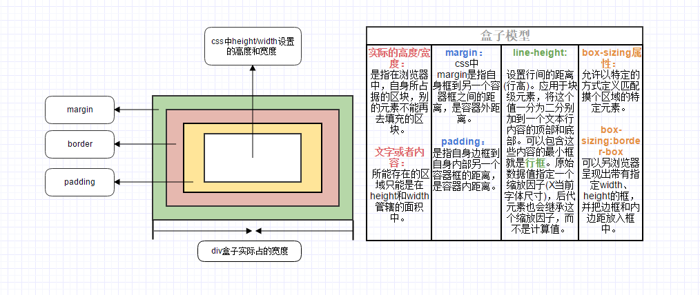

### CSS

1. 圣杯布局的原理和实现、双飞翼。

  答案：圣杯布局是一种非常经典和常用的布局方式，其所指的是三列布局，中间宽度自适应，两边定宽；或者两列布局，主体宽度自适应，左边或右边定宽。

  圣杯布局：用到浮动、负边距、相对定位，不添加额外标签
  

  1、中间部分需要根据浏览器宽度的变化而变化，所以要用100%，(这里设置的center 的宽度为了100%不包括padding)这里设左中右向左浮动，因为中间100%，左层和右层根本没有位置上去。此处html结构中中间部分要先写。

  2、用css控制各块到各自位置上。简单的办法是使用负margin。负margin的原理是盒子模型的算法`内容+padding+border+margin `想一下这个公式里如果有一个负值，总和会怎么变，占据宽度空间会怎么变。把左层负margin150后，发现left上去了，因为负到出窗口没位置了，只能往上挪。那么按这个方法，可以得出它只要挪动窗口宽度那么宽就能到最左边了，利用负边距，把左右栏定位。

  3、俩侧边栏虽已经和中间主题内容处于同一行，但是肯定不能遮挡要平移到对应位置上。直接给父元素加个padding。

  4、但是加了之后左右栏也缩进来了，于是采用相对定位方法，俩侧边栏移到padding区域就搞定了。(position为static时，left设置没用，left：20px表示距离父元素的左边20px)

  ```html
  <body>
      <div class="header">头部</div>
      <div class="container">   
        <div class="main">主内容栏自适应宽度</div>
        <div class="left">侧边栏1固定宽度</div>
        <div class="right">侧边栏2固定宽度</div>
      </div>
      <div class="footer">底部</div>
  </body>
  ```
  ```css
  body{
    padding:0;
    margin:0
  }
  .header,.footer{
    width:100%;  
    background: #666;
    height:30px;clear:both;
    text-align :center
  }
  .container{
    padding-left:150px;
    padding-right:190px;
    text-align :center
  }
  .left{
    background: #E79F6D;
    width:150px;
    float:left;
    margin-left:-100%;
    position: relative;
    left:-150px;
  }
  .main{
     background: #D6D6D6;
     width:100%;
     float:left;

  }
  .right{
     background: #77BBDD;
     width:190px;
     float:left;
     margin-left:-190px;
     position:relative;
     right:-190px;
   }
  ```
  双飞翼布局就是不使用相对布局，将中间主内容在使用一个`div class="mid"`包裹起来，仅使用浮动和负margin实现圣杯布局。
  ```html
  <body>
      <div class="header">头部</div>
      <div class="container">  
        <div class = "main">
          <div class="mid">主内容栏自适应宽度</div>
        </div>
        <div class="left">侧边栏1固定宽度</div>
        <div class="right">侧边栏2固定宽度</div>
      </div>
      <div class="footer">底部</div>
  </body>
  ```
  ```css
  .container{
    text-align :center
  }
  .main .mid{
  margin-left:150px;
  margin-right:190px;
  }
  .main{
  background: #D6D6D6;
  width:100%;
  float:left;
  }  
  .left{
    background: #E79F6D;
    width:150px;
    float:left;
    margin-left:-100%;
  }
  .right{
     background: #77BBDD;
     width:190px;
     float:left;
     margin-left:-190px;
  }
  ```

  参考：

   - [圣杯布局的实现过程](http://www.cnblogs.com/wuguoyuan/p/grail.html)

2. 盒子模型。

  答案：浏览器的盒子模型指的是它的盒子宽度需要包括内容区宽度、内外边距和边框大小，高度类似。一般设置宽度默认是对应内容区宽度。

  兼容性方面：在IE7以前的版本中设置宽度是包括：内边距+边框+内容区的。IE7之后跟其它浏览器一样，都是只对应内容区的宽度。可以通过修改box-sizing:border-box来修改。让设置宽度等于内容区和边框和内边距之和。
  

3. 如何通过`CSS`改变盒子模型的布局？

  答案：人们慢慢的意识到传统的盒子模型不直接，所以他们新增了一个叫做 box-sizing 的CSS属性。当你设置一个元素为 box-sizing: border-box; 时，此元素的内边距和边框不再会增加它的宽度。它是支持IE8+的。
  ```css
  * {
    -webkit-box-sizing: border-box;
       -moz-box-sizing: border-box;
            box-sizing: border-box;
  }
  ```
  参考：

   - [学习CSS布局](http://zh.learnlayout.com/box-sizing.html)

4. `CSS`几种定位方式的概念和区别。

  答案：注意的是定位的参照：relative参照于自己该出现的位置，而absolute参照于祖先元素中与自己最近的已定位元素(relative或者absolute)直到body元素。

5. `CSS`实现动画有几种方式？
6. `CSS`不同选择器的权重。
7. ·`flexbox`布局的基本原理和用法。
8. 块级元素和行内元素的区别？
9. 浮动的原理。
10. 清除浮动有哪几种方式以及它们的优缺点？
11. 如何利用`CSS`实现垂直居中？
12. `CSS`预处理器(`sass`， `less`， `stylus`)的优缺点。
13. `base64`的原理及优缺点
14. `reset.css`和`normalize.css`的区别。
15. `html`标签`<link href=""/>`和`css`文件中的`@import`指令的区别。
16. `CSS`字体单位`rem`、 `em` 和`px` 之间的区别和联系？
17. `CSS3`新特性有哪些？
18. 列出你所知道可以改变页面布局的属性。
