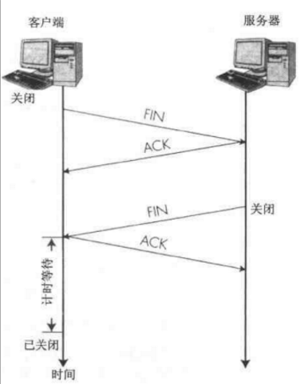

### HTTP

1. `HTTPS`的原理。

  答案：HTTPS(Secure Hypertext Transfer Protocol)安全超文本传输协议,它是一个安全通信通道，它基于HTTP开发，用于在客户计算机和服务器之间交换信息。它使用安全套接字层(SSL)进行信息交换，简单来说它是HTTP的安全版。 它是由Netscape开发并内置于其浏览器中，用于对数据进行压缩和解压操作，并返回网络上传送回的结果。HTTPS实际上应用了Netscape的安全套接字层(SSL)作为HTTP应用层的子层。(HTTPS使用端口443，而不是像HTTP那样使用端口80来和TCP/IP进行通信。)SSL使 用40 位关键字作为RC4流加密算法，这对于商业信息的加密是合适的。HTTPS和SSL支持使用X.509数字认证，如果需要的话用户可以确认发送者是谁。

  SSL的简介：

  SSL是Netscape公司所提出的安全保密协议，在浏览器(如Internet Explorer、Netscape Navigator)和Web服务器(如Netscape的Netscape Enterprise Server、ColdFusion Server等等)之间构造安全通道来进行数据传输，SSL运行在TCP/IP层之上、应用层之下，为应用程序提供加密数据通道，它采用了RC4、MD5 以及RSA等加密算法，使用40 位的密钥，适用于商业信息的加密。同时，Netscape公司相应开发了HTTPS协议并内置于其浏览器中，HTTPS实际上就是SSL over HTTP，它使用默认端口443，而不是像HTTP那样使用端口80来和TCP/IP进行通信。HTTPS协议使用SSL在发送方把原始数据进行加密，然 后在接受方进行解密，加密和解密需要发送方和接受方通过交换共知的密钥来实现，因此，所传送的数据不容易被网络黑客截获和解密。 然而，加密和解密过程需要耗费系统大量的开销，严重降低机器的性能，相关测试数据表明使用HTTPS协议传输数据的工作效率只有使用HTTP协议传输的十 分之一。假如为了安全保密，将一个网站所有的Web应用都启用SSL技术来加密，并使用HTTPS协议进行传输，那么该网站的性能和效率将会大大降低，而 且没有这个必要，因为一般来说并不是所有数据都要求那么高的安全保密级别，所以，我们只需对那些涉及机密数据的交互处理使用HTTPS协议，这样就做到鱼与熊掌兼得。总之不需要用https 的地方,就尽量不要用。
  参考：

    - [听大神说https和http区别](http://network.51cto.com/art/201502/465280.htm#rd?sukey=b0cb5c5b9e5013037ef7b04e199bc517bd68aadcae9a70034fef1f357950718e4662c416245563c75696d481de7c98d3)

2. `HTTP`和`HTTPS`的区别。

  答案：https协议需要到CA 申请证书，一般免费证书很少，需要交费； http是超文本传输协议，信息是明文传输；https 则是具有安全性的ssl加密传输协议；http和https使用的是完全不同的连接方式用的端口也不一样,前者是80,后者是443。 http的连接很简单,是无状态的；HTTPS协议是由SSL+HTTP协议构建的可进行加密传输、身份认证的网络协议，要比http协议安全。

  HTTPS解决的问题：
  1. 信任主机的问题.

    采用https 的server 必须从CA 申请一个用于证明服务器用途类型的证书. 改证书只有用于对应的server 的时候,客户度才信任次主机. 所以目前所有的银行系统网站,关键部分应用都是https 的. 客户通过信任该证书,从而信任了该主机. 其实这样做效率很低,但是银行更侧重安全.

  2. 通讯过程中的数据的泄密和被窜改

    1. 一般意义上的https, 就是 server 有一个证书.

       * 主要目的是保证server 就是他声称的server. 这个跟第一点一样.
       * 服务端和客户端之间的所有通讯,都是加密的.
       * 具体讲,是客户端产生一个对称的密钥,通过server 的证书来交换密钥. 一般意义上的握手过程.
       * 加下来所有的信息往来就都是加密的. 第三方即使截获,也没有任何意义.因为他没有密钥. 当然窜改也就没有什么意义了.
    2. 少许对客户端有要求的情况下,会要求客户端也必须有一个证书.

3. `TCP/IP`四层模型。

  答案：TCP/IP模型实际上是OSI模型的一个浓缩版本，它只有四个层次：
  1. 应用层，对应着OSI的应用层、表示层、会话层
  2. 传输层，对应着OSI的传输层
  3. 网络层，对应着OSI的网络层
  4. 网络接口层，对应着OSI的数据链路层和物理层
  OSI模型的网络层同时支持面向连接和无连接的通信，但是传输层只支持面向连接的通信；TCP/IP模型的网络层只提供无连接的服务，但是传输层上同时提供两种通信模式。

4. `TCP`，`IP`， `HTTP`的相关概念。

  答案：国际标准化组织（ISO）制定了OSI(开放式系统互联)模型，该模型定义了不同计算机互联的标准，是设计和描述计算机网络通信的基本框架。OSI模型把网络通信的工作分为7层，分别是物理层、数据链路层、网络层、传输层、会话层、表示层和应用层。(网络中各结点都有相同的层次;不同结点相同层次具有相同的功能;同一结点相邻层间通过接口通信;每一层可以使用下层提供的服务，并向上层提供服务;不同结点的同等层间通过协议来实现对等层间的通信)(对等层通信的实质：对等层实体之间虚拟通信；下层向上层提供服务；实际通信在最底层完成；发送方数据由最高层逐渐向下层传递，到接收方数据由最低层逐渐向高层传递。)(OSI参考模型中，对等层协议之间交换的信息单元统称为协议数据单元(PDU，Protocol Data Unit)。而传输层及以下各层的PDU另外还有各自特定的名称：应用层--数据（Data）传输层——数据段（Segment）网络层——分组（数据包）（Packet）数据链路层——数据帧（Frame）物理层——比特（Bit）)

  不同的协议在最初OSI模型中的位置:为方便记忆可以将七层从高到低视为：All People Seem To Need Data Processing。每一个大写字母与七层名称头一个字母相对应。

  

  “IP”代表网际协议，TCP和UDP使用该协议从一个网络传送数据包到另一个网络。把IP想像成一种高速公路，它允许其它协议在上面行驶并找到到其它电脑的出口。TCP和UDP是高速公路上的“卡车”，它们携带的货物就是像HTTP，文件传输协议FTP这样的协议等。

  IP的概念

  英文为Internet Protocol，翻译成网际协议，位于网络层。因为几乎所有使用网络的系统都会用到IP协议。把各种数据包传送给对方。如果要保证确定传送到对方那里，则需要满足各类条件，其中最重要的两个条件是IP地址和MAC地址。(IP地址：指明了节点被分配到的地址,MAC地址：是指网卡所属的固定地址;IP地址可变换，但MAC地址基本上不会更改。)

  TCP协议的概念与作用

  英文为Transmission Control Protocol ，翻译成传输控制协议，位于传输层。它是提供可靠的字节流服务。所谓的字节流服务指的是，为了方便传输，将大块数据分割成以报文段为单位的数据包进行管理.因为它能够把数据准确可靠地传送给对方。总而言之，TCP协议就是为了 更容易传送大数据才把数据分割，而且TCP协议能够确认数据  最终是否送达对方。它采用了三次握手策略,也就是用TCP协议 把数据包送出去后，它不会对传送后的情况置之不理，它一定会想对方确认是否成功送达。

  http协议

  HTTP协议即超文本传送协议(Hypertext Transfer Protocol )，建立在TCP协议之上，位于应用层。HTTP连接最显著的特点是客户端发送的每次请求都需要服务器回送响应，在请求结束后，会主动释放连接。从建立连接到关闭连接的过程称为“一次连接”。简单快速：客户向服务器请求服务时，只需传送请求方法和路径。请求方法常用的有GET、HEAD、POST。每种方法规定了客户与服务器联系的类型不同。由于HTTP协议简单，使得HTTP服务器的程序规模小，因而通信速度很快。HTTP允许传输任意类型的数据对象。正在传输的类型由Content-Type加以标记。还有HTTP协议是无状态协议。无状态是指协议对于事务处理没有记忆能力。

  举个例子：
  首先是，我想访问网站，将域名发送给DNS去解析，DNS解析后将网站的IP地址返回给客户端，然后通过IP地址发起HTTP请求。HTTP此时的作用是 生成针对目标WEB服务器（我们这里指的是网站的服务器）的HTTP请求报文，然后将请求报文传送给传输层，此时为了方便通信，TCP会将HTTP请求报文  分割成报文段，这些报文段会有一个序号，这里的报文段哪一个先发送哪一个先到达，它们是按序传送的。只要建立起TCP连接，客户端与服务器之间的报文交换就不会丢失，不会被破坏，也不会在接收时出现错序。接着到了网络层，此时IP协议的职责是，搜索对方的地址，一边中转一边传送。然后找到了服务器的位置，此时服务器的传输层中 TCP的职责是  接收到对方传送过来的报文段后，对其进行重组，这里的重组是按序号进行重组的。然后到了服务器的应用层，HTTP会对客户端请求的内容进行处理。处理完后，服务器同样会利用TCP/IP通信协议向客户端进行回传响应。最后客户端收到响应后，将内容输出页面显示。即完成了一次HTTP事务。

5. `TCP`三次握手的过程。

  答案：
  建立起一个TCP连接需要经过“三次握手”：首先Client端发送连接请求报文，Server段接受连接后回复ACK报文，并为这次连接分配资源。Client端接收到ACK报文后也向Server段发生ACK报文，并分配资源，这样TCP连接就建立了。

  第一次握手：客户端发送syn包(syn=j)到服务器，并进入SYN_SEND状态，等待服务器确认；

  第二次握手：服务器收到syn包，必须确认客户的SYN（ack=j+1），同时自己也发送一个SYN包（syn=k），即SYN+ACK包，此时服务器进入SYN_RECV状态；

  第三次握手：客户端收到服务器的SYN＋ACK包，向服务器发送确认包ACK(ack=k+1)，此包发送完毕，客户端和服务器进入ESTABLISHED状态，完成三次握手。

  握手过程中传送的包里不包含数据，三次握手完毕后，客户端与服务器才正式开始传送数据。理想状态下，TCP连接一旦建立，在通信双方中的任何一方主动关闭连接之前，TCP 连接都将被一直保持下去。断开连接时服务器和客户端均可以主动发起断开TCP连接的请求，断开过程需要经过“四次握手”.因为当Server端收到Client端的SYN连接请求报文后，可以直接发送SYN+ACK报文。其中ACK报文是用来应答的，SYN报文是用来同步的。但是关闭连接时，当Server端收到FIN报文时，很可能并不会立即关闭SOCKET，所以只能先回复一个ACK报文，告诉Client端，"你发的FIN报文我收到了"。只有等到我Server端所有的报文都发送完了，我才能发送FIN报文，因此不能一起发送。故需要四步握手。

  

  假设Client端发起中断连接请求，也就是发送FIN报文。Server端接到FIN报文后，意思是说"我Client端没有数据要发给你了"，但是如果你还有数据没有发送完成，则不必急着关闭Socket，可以继续发送数据。所以你先发送ACK，"告诉Client端，你的请求我收到了，但是我还没准备好，请继续你等我的消息"。这个时候Client端就进入FIN_WAIT状态，继续等待Server端的FIN报文。当Server端确定数据已发送完成，则向Client端发送FIN报文，"告诉Client端，好了，我这边数据发完了，准备好关闭连接了"。Client端收到FIN报文后，"就知道可以关闭连接了，但是他还是不相信网络，怕Server端不知道要关闭，所以发送ACK后进入TIME_WAIT状态，如果Server端没有收到ACK则可以重传。“，Server端收到ACK后，"就知道可以断开连接了"。Client端等待了2MSL后依然没有收到回复，则证明Server端已正常关闭，那好，我Client端也可以关闭连接了。Ok，TCP连接就这样关闭了！

6. `TCP`和`UDP`的区别。

  答案：OSI 和 TCP/IP 模型在传输层定义两种传输协议：TCP（或传输控制协议）和 UDP（或用户数据报协议）。

  UDP 与 TCP 的主要区别在于 UDP 不一定提供可靠的数据传输。事实上，该协议不能保证数据准确无误地到达目的地。UDP 在许多方面非常有效。当某个程序的目标是尽快地传输尽可能多的信息时（其中任意给定数据的重要性相对较低），可使用 UDP。TCP的目的是提供可靠的数据传输，并在相互进行通信的设备或服务之间保持一个虚拟连接。TCP在数据包接收无序、丢失或在交付期间被破坏时，负责数据恢复。它通过为其发送的每个数据包提供一个序号来完成此恢复。为确保正确地接收数据，TCP要求在目标计算机成功收到数据时发回一个确认（即 ACK）。如果在某个时限内未收到相应的 ACK，将重新传送数据包。如果网络拥塞，这种重新传送将导致发送的数据包重复。但是，接收计算机可使用数据包的序号来确定它是否为重复数据包，并在必要时丢弃它。很明显UDP包不具备TCP包复杂的可靠性与控制机制。当数据传输的性能必须让位于数据传输的完整性、可控制性和可靠性时，TCP协议是当然的选择。当强调传输性能而不是传输的完整性时，如：音频和多媒体应用，UDP是最好的选择。在数据传输时间很短，以至于此前的连接过程成为整个流量主体的情况下，UDP也是一个好的选择，如：DNS交换。把SNMP建立在UDP上的部分原因是设计者认为当发生网络阻塞时，UDP较低的开销使其有更好的机会去传送管理数据。

  TCP协议和UDP协议特性区别总结：
     1. TCP协议在传送数据段的时候要给段标号；UDP协议不
     2. TCP协议可靠；UDP协议不可靠
     3. TCP协议是面向连接；UDP协议采用无连接
     4. TCP协议负载较高，采用虚电路；UDP采用无连接
     5. TCP协议的发送方要确认接收方是否收到数据段（3次握手协议）
     6. TCP协议采用窗口技术和流控制。

  你应该能理解，TCP和UDP是FTP，HTTP和SMTP之类使用的传输层协议。虽然TCP和UDP都是用来传输其他协议的，它们却有一个显著的不同：TCP提供有保证的数据传输，而UDP不提供。这意味着TCP有一个特殊的机制来确保数据安全的不出错的从一个端点传到另一个端点，而UDP不提供任何这样的保证。
  HTTP(超文本传输协议)是利用TCP在两台电脑(通常是Web服务器和客户端)之间传输信息的协议。客户端使用Web浏览器发起HTTP请求给Web服务器，Web服务器发送被请求的信息给客户端。

  参考：

    - [TCP和UDP之间的区别](http://feinibuke.blog.51cto.com/1724260/340272/)

7. `TCP`的拥塞控制。

  答案：   计算机网络中的带宽、交换结点中的缓存和处理机等，都是网络的资源。在某段时间，若对网络中某一资源的需求超过了该资源所能提供的可用部分，网络的性能就会变坏。这种情况就叫做拥塞。

  拥塞控制就是防止过多的数据注入网络中，这样可以使网络中的路由器或链路不致过载。拥塞控制是一个全局性的过程，和流量控制不同，流量控制指点对点通信量的控制。

  慢开始与拥塞避免算法、快重传和快恢复算法、以及路由器采用随机早期检测(RED:randomearly detection)避免发生网路中的全局同步现象(这许多的TCP连接在同一时间进入慢开始状态)，让拥塞控制只在个别的TCP连接上执行，因而避免全局性的拥塞控制。
  参考：

    - [ TCP的拥塞控制](http://blog.csdn.net/sicofield/article/details/9708383)

8. `HTTP`常见的状状态码。

  答案：常用的http转态码如下
  * 1XX--提示信息
  * 100--继续
  * 101--更改协议
  * 2XX--成功
  * 200(OK)--客户端请求成功;找到了该资源，并且一切正常
  * 3XX--重定向
  * 301--永久转移
  * 302--暂时转移
  * 304(NOT MODIFIED)--未修改,该资源在上次请求之后没有任何修改。这通常用于浏览器的缓存机制
  * 4XX--客户端错误
  * 400--错误的请求
  * 401(UNAUTHORIZED)--访问被拒绝,客户端无权访问该资源。这通常会使得浏览器要求用户输入用户名和密码，以登录到服务器。
  * 402--禁止访问
  * 403(FORBIDDEN)--客户端未能获得授权。这通常是在401之后输入了不正确的用户名或密码。
  * 404(NOT FOUND)--未找到,在指定的位置不存在所申请的资源
  * 5XX--服务端错误
  * 500--服务器内部错误
  * 503--服务不可用
  * 504--网关超时

  参考：

    - [HTTP状态码大全](http://www.cnblogs.com/lxinxuan/archive/2009/10/22/1588053.html)
    - [HTTP状态码](http://baike.baidu.com/link?url=AH6tSqJ3BggCDyxm799uHviR-j9xVj9BMWq5NzZi6uLzBenVRzNja8wJqb9EHvevL7pdxgaKuBL90RHpPXXz0_)

9. `HTTP`头部包含的信息及作用。

  答案：正确的设置HTTP头部信息有助于搜索引擎判断网页及提升网站访问速度。通常HTTP消息包括客户机向服务器的请求消息和服务器向客户机的响应消息。客户端向服务器发送一个请求，请求头包含请求的方法、URI、协议版本、以及包含请求修饰符、客户信息和内容的类似于MIME的消息结构。服务器以一个状态行作为响应，相应的内容包括消息协议的版本，成功或者错误编码加上包含服务器信息、实体元信息以及可能的实体内容。HTTP的头域包括通用头、请求头、响应头和实体头四个部分。每个头域由一个域名，冒号（:）和域值三部分组成。

  1. HTTP通用头：是客户端和服务器都可以使用的头部，可以在客户端、服务器和其他应用程序之间提供一些非常有用的通用功能，通用头域包含缓存头部Cache-Control、Pragma及信息性头部Connection、Date、Transfer-Encoding、Update、Via。

    1. Cache-Control指定请求和响应遵循的缓存机制。请求时的缓存指令包括no-cache(指示请求或响应消息不能缓存，实际上是可以存储在本地缓存区中的，只是在与原始服务器进行新鲜度验证之前，缓存不能将其提供给客户端使用。)、no-store(缓存应该尽快从存储器中删除文档的所有痕迹，因为其中可能会包含敏感信息)、max-age(缓存无法返回缓存时间长于max-age规定秒的文档，若不超规定秒浏览器将不会发送对应的请求到服务器，数据由缓存直接返回；超过这一时间段才进一步由服务器决定是返回新数据还是仍由缓存提供)、 max-stale、min-fresh、only-if-cached，响应消息中的指令包括public(指示响应可被任何缓存区缓存，可以用缓存内容回应任何用户)、private(指示对于单个用户的整个或部分响应消息，不能被共享缓存处理，只能用缓存内容回应先前请求该内容的那个用户)、no-cache、no- store、no-transform、must-revalidate、proxy-revalidate、max-age。
    2. Pragma头域用来包含实现特定的指令，最常用的是Pragma:no-cache。在HTTP/1.1协议中，它的含义和Cache- Control:no-cache相同。
    3. Connection表示是否需要持久连接:Close：告诉WEB服务器或者代理服务器，在完成本次请求的响应后，断开连接，不要等待本次连接的后续请求了。Keepalive：告诉WEB服务器或者代理服务器，在完成本次请求的响应后，保持连接，等待本次连接的后续请求。Keep-Alive：如果浏览器请求保持连接，则该头部表明希望WEB 服务器保持连接多长时间（秒），如Keep-Alive：300。
    4. Date头域表示消息发送的时间，服务器响应中要包含这个头部，因为缓存在评估响应的新鲜度时要用到，其时间的描述格式由RFC822定义。例如，Date:Mon, 31 Dec 2001 04:25:57 GMT。
    5. Transfer-Encoding:WEB 服务器表明自己对本响应消息体（不是消息体里面的对象）作了怎样的编码，比如是否分块（chunked），例如：Transfer-Encoding: chunked
    6. Upgrade:它可以指定另一种可能完全不同的协议
    7. Via:列出从客户端到 OCS 或者相反方向的响应经过了哪些代理服务器，他们用什么协议（和版本）发送的请求。当客户端请求到达第一个代理服务器时，该服务器会在自己发出的请求里面添加 Via 头部，并填上自己的相关信息，当下一个代理服务器 收到第一个代理服务器的请求时，会在自己发出的请求里面复制前一个代理服务器的请求的Via头部，并把自己的相关信息加到后面，以此类推，当 OCS 收到最后一个代理服务器的请求时，检查 Via 头部，就知道该请求所经过的路由。例如：Via：1.0 236-81.D07071953.sina.com.cn:80 (squid/2.6.STABLE13)
  2. HTTP请求头部是请求报文特有的，它们为服务器提供了一些额外信息，比如客户端希望接收什么类型的数据，如Accept头部。服务器可以根据请求头部给出的客户端信息，试着为客户端提供更好的响应。请求头域可能包含下列字段Accept(告诉WEB服务器自己接受什么介质类型，`*/* `表示任何类型，`type/* `表示该类型下的所有子类型，`type/sub-type`。)、Accept-Charset(浏览器告诉服务器自己能接收的字符集)、Accept- Encoding(浏览器申明自己接收的编码方法，通常指定压缩方法)、Accept-Language(浏览器申明自己接收的语言。语言跟字符集的区别：中文是语言，中文有多种字符集，比如big5，gb2312，gbk等等。)、Authorization(当客户端接收到来自WEB服务器的 WWW-Authenticate 响应时，用该头部来回应自己的身份验证信息给WEB服务器。)、From、Host(客户端指定自己想访问的WEB服务器的域名/IP 地址和端口号。如Host：rss.sina.com.cn)、If-Modified-Since、If-Match、If-None-Match、If-Range、If-Range(浏览器（比如 Flashget 多线程下载时）告诉 WEB 服务器自己想取对象的哪部分)、If-Unmodified-Since、Max-Forwards、Proxy-Authorization、Range、Referer(浏览器向WEB 服务器表明自己是从哪个网页URL获得点击当前请求中的网址/URL，例如：`Referer：http://www.ecdoer.com/`)、User-Agent(浏览器表明自己的身份（是哪种浏览器）)。对请求头域的扩展要求通讯双方都支持，如果存在不支持的请求头域，一般将会作为实体头域处理。
  3. HTTP响应头部响应头向客户端提供一些额外信息，比如谁在发送响应、响应者的功能，甚至与响应相关的一些特殊指令。这些头部有助于客户端处理响应，并在将来发起更好的请求。响应头域包含Age(当代理服务器用自己缓存的实体去响应请求时，用该头部表明该实体从产生到现在经过多长时间了。)、Location、Proxy-Authenticate、Public、Retry- After、Server(WEB 服务器表明自己是什么软件及版本等信息。例如：Server：Apache/2.0.61 (Unix))、Vary、Warning、WWW-Authenticate。对响应头域的扩展要求通讯双方都支持，如果存在不支持的响应头域，一般将会作为实体头域处理。
  4. HTTP实体头部提供了有关实体及其内容的大量信息，从有关对象类型的信息，到能够对资源使用的各种有效的请求方法。总之，实体头部可以告知接收者它在对什么进行处理。请求消息和响应消息都可以包含实体信息，实体信息一般由实体头域和实体组成。实体头域包含关于实体的原信息，实体头包括信息性头部Allow(服务器支持哪些请求方法（如GET、POST等）)、Location(表示客户应当到哪里去提取文档，用于将接收端定位到资源的位置（URL）上。Location通常不是直接设置的，而是通过HttpServletResponse的sendRedirect方法，该方法同时设置状态代码为302)，内容头部Content-Base、Content-Encoding、Content-Language(WEB 服务器告诉浏览器理解主体时最适宜使用的自然语言)、Content-Length、Content-Location、Content-MD5、Content-Range、Content-Type，缓存头部Etag(就是一个对象（比如URL）的标志值，就一个对象而言，比如一个html文件，如果被修改了，其Etag也会别修改，所以，ETag的作用跟Last-Modified的作用差不多，主要供WEB服务器判断一个对象是否改变了。比如前一次请求某个html文件时，获得了其 ETag，当这次又请求这个文件时，浏览器就会把先前获得ETag值发送给WEB服务器，然后WEB服务器会把这个ETag跟该文件的当前ETag进行对比，然后就知道这个文件有没有改变了。)、Expires(WEB服务器表明该实体将在什么时候过期，对于过期了的对象，只有在跟WEB服务器验证了其有效性后，才能用来响应客户请求。是 HTTP/1.0 的头部。)、Last-Modified、extension-header。

  参考：

    - [HTTP头信息解读 SEO必知](http://www.ecdoer.com/post/http-seo.html)

10. `HTTP`缓存控制的原理。

  答案：
  1. 缓存的优点

      * 缓存减少了冗余的数据传输，节省了网络费用;
      * 缓存缓解了网络瓶颈的问题，不需要更多的网络带宽就能更快的加载页面;
      * 缓存降低了对原始服务器的要求，服务器可以更快的响应。
  2. 缓存分类：

      * 私有缓存：常见就是我们的浏览器里内置的缓存；
      * 公有缓存：常见的就是代理缓存，不多介绍。
  3. 缓存的处理流程

      1. 请求处理:用户发起一个http请求，缓存获取到URL，根据URL查找是否有匹配的副本，这个副本可能在内存中，也可能在本地磁盘。
      2. 新鲜度检测:HTTP发起一个请求时，发现缓存中有相应的所请求资源的副本，接着就会检查这个副本有没有过期，如果没有过期，直接使用。如果已经过期，则进行再验证。
      3. 服务器再验证:缓存中的文档过期了并不代表他和服务器上的不一样，所以这个时候就需要问问服务器，过期的这段时间里这个文档到底有没有改变。如果改变了，缓存就会获取一份新的文档副本，然后发送给客户端。如果没有改变，缓存只需要获取新的首部，包括一个新的过期时间。
      4. 创建响应并返回:希望缓存看起来就像是来自原始服务器一样，缓存将已缓存的服务器响应首部作为响应首部，发送给客户端。
  4. 保质期的实现:HTTP中，通过Cache-Control首部和Expires首部为文档指定了过期时间，通过对过期时间的判断，缓存就可以知道文档是不是在保质期内。Expires首部和Cache-Control:max-age首部都是来告诉缓存文档有没有过期，Expires首部是HTTP 1.0中提出来的，因为他使用的是绝对日期，如果服务端和客户端时钟不同步的话（实际上这种情况非常常见），缓存可能就会认为文档已经过了保质期。HTTP 1.1为了修正这个问题，引入了Cache-Control:max-age首部，这个首部使用相对时间来控制保质期，让一切变得更加合理。
  5. 服务器再验证的实现:缓存要问问服务器，文档已经过期了，到底还能不能用。HTTP中，使用两个请求请首部来完成这个功能：If-Modified-Sice和If-None-Match。一开始使用 If-Modified-Sice:<date>首部，date是上一次缓存文档时，响应中Last-Modified首部的值。客户端拿着这个值，问服务器，这段时间内这个文档你有没有修改过？服务器看了看这个文档的修改时间，如果没有修改过，会返回一个304 Not Modified的响应；如果修改过，把最新的文档返回给客户端。后来，人们发现这样有问题，因为就算修改时间变化了，文档也不一定发生改变！于是乎，就有了 If-None-Match:<tag>首部，tag是上一次缓存文档时，响应中Etag的值，Etag是一种唯一标识资源的方式，就像java中的hashcode，如果hashcode不一样，那么两个对象肯定不一样！
  6. 试探性过期：如果响应中既没有Cache-Control:max-age首部又没有Expires首部，缓存可以计算出一个试探性最大使用期。这东西打个比方就是缓存会根据响应的Last-Modified来决定这文档靠不靠谱，需不需要再验证，如果Last-Modified中的日期是很早之前，那缓存就认为这文档挺靠谱，近期之内应该不会变化；如果Last-Modified中的日期是最近几天，那缓存可能就认为这文档可能经常改变，不靠谱。当然这么粗略的判断想想就知道不严谨，所以我们一定要设置Expires首部和Cache-Control首部。

  参考：

    - [HTTP协议：缓存](http://kb.cnblogs.com/page/166267/)

11. `SEO`是什么，有什么最佳实践？

  答案：SEO（Search Engine Optimization），就是传说中的搜索引擎优化，是指为了增加网页在搜索引擎自然搜索结果中的收录数量以及提升排序位置而做的优化行为。
  1. 突出重要内容：合理的title、description和keywords，title。强调重点、高度概括、长度要合理，不过分堆砌关键词；
  2. 语义化书写HTML代码，符合W3C标准：对于搜索引擎来说，最直接面对的就是网页HTML代码，如果代码写的语义化，搜索引擎就会很容易的读懂该网页要表达的意思。例如文本模块要有大标题，合理利用h1-h6，列表形式的代码使用ul或ol，重要的文字使用strong等等。总之就是要充分利用各种HTML标签完成他们本职的工作，当然要兼容IE、火狐、Chrome等主流浏览器。充分利用HTML5新增语义化标签；
  3. 利用布局，把重要内容HTML代码放在最前。重要内容不要用JS输出。蜘蛛不会读取JS里的内容，所以重要内容必须放在HTML里。尽少使用iframe框架。搜索引擎不会抓取到iframe里的内容，重要内容不要放在框架中。
  4. 为图片加上alt属性。当网络速度很慢，或者图片地址失效的时候，就可以体现出alt属性的作用，他可以让用户在图片没有显示的时候知道这个图片的作用。为图片设置高度和宽度，可提高页面的加载速度。
  5. 尽量外链CSS和JS，把内容、表现和行为分离开，保证代码整洁的同时也方便维护。CSS放在文件头部，JS放在文件尾部，可使用工具对CSS和JS文件进行压缩。CSS Sprites。
  6. 为静态资源文件增加过期时间，让用户通过本地缓存来更快的访问网站。
  7. 压缩、格式化代码。可以在上线前，使用一些工具，把HTML、CSS和JS都压缩、格式化一下，可以减少页面大小。减少大改版的频率。
  8. 不使用CSS表达式，会影响效率；使用CDN网络，可加快用户访问速度；启用GZIP压缩，浏览速度变快，搜索引擎的蜘蛛抓取信息量也会增大；善于利用浏览器插件。

  参考：

    - [浅谈前端与SEO](http://uxc.360.cn/archives/984.html)

12. `POST`和`GET`的异同

  答案：Http协议定义了很多与服务器交互的方法，最基本的有4种，分别是GET、POST、PUT、DELETE。一个URL地址用于描述一个网络上的资源，而HTTP中的GET、POST、PUT、 DELETE就对应着对这个资源的查、改、增、删4个操作，我们最常见的就是GET和POST了。GET一般用于获取/查询资源信息，而POST一般用于更新资源信息。
  1. get是从服务器上获取数据，post是向服务器传送数据。
  2. get是把参数数据队列加到提交表单的ACTION属性所指的URL中，值和表单内各个字段一一对应，在URL中可以看到。post是通过HTTP post机制，将表单内各个字段与其内容放置在HTML HEADER内一起传送到ACTION属性所指的URL地址。用户看不到这个过程。
  3. 对于get方式，服务器端用Request.QueryString获取变量的值，对于post方式，服务器端用Request.Form获取提交的数据。
  4. get安全性非常低，post安全性较高。但是执行效率却比Post方法好。

  建议：
  1. get方式的安全性较Post方式要差些，包含机密信息的话，建议用Post数据提交方式；
  2. 在做数据查询时，建议用Get方式；而在做数据添加、修改或删除时，建议用Post方式。

  HTTP请求：
  ```html
  <request line>//第一行必须是一个请求行（request line），用来说明请求类型、要访问的资源以及使用的HTTP版本
  <headers>
  <blank line>//在首部之后是一个空行,再此之后可以添加任意的其他数据[称之为主体（body）]。
  <request-body>]
  ```
  ```
  GET /books/?sex=man&name=Professional HTTP/1.1
  Host: www.wrox.com
  User-Agent: Mozilla/5.0 (Windows; U; Windows NT 5.1; en-US; rv:1.7.6)
  Gecko/20050225 Firefox/1.0.1
  Connection: Keep-Alive

  POST / HTTP/1.1
  Host: www.wrox.com
  User-Agent: Mozilla/5.0 (Windows; U; Windows NT 5.1; en-US; rv:1.7.6)
  Gecko/20050225 Firefox/1.0.1
  Content-Type: application/x-www-form-urlencoded
  Content-Length: 40
  Connection: Keep-Alive
  （----此处空一行----）
  name=Professional%20Ajax&publisher=Wiley
  ```
  1. GET提交，请求的数据会附在URL之后（就是把数据放置在请求行（request line）中），以?分割URL和传输数据，多个参数用&连接；例如：login.action?name=hyddd&password=idontknow&verify=%E4%BD%A0 %E5%A5%BD。Url的编码格式采用的是ASCII码，而不是Unicode，这也就是说你不能在Url中包含任何非ASCII字符，所有非ASCII字符均需要编码再传输，关于Url编码可参考：`http://kb.cnblogs.com/page/133765/`。POST提交：把提交的数据放置在是HTTP包的包体中。上文示例中`name=Professional%20Ajax&publisher=Wiley`就是实际的传输数据。因此，GET提交的数据会在地址栏中显示出来，而POST提交，地址栏不会改变。
  2. 传输数据的大小：首先声明：HTTP协议没有对传输的数据大小进行限制，HTTP协议规范也没有对URL长度进行限制。而在实际开发中存在的限制主要有：GET:特定浏览器和服务器对URL长度有限制，例如IE对URL长度的限制是2083字节(2K+35)。对于其他浏览器，如Netscape、FireFox等，理论上没有长度限制，其限制取决于操作系统的支持。因此对于GET提交时，传输数据就会受到URL长度的限制。POST:由于不是通过URL传值，理论上数据不受限。但实际各个WEB服务器会规定对post提交数据大小进行限制，Apache、IIS6都有各自的配置。
  3. 安全性：.POST的安全性要比GET的安全性高。比如：通过GET提交数据，用户名和密码将明文出现在URL上，因为(1)登录页面有可能被浏览器缓存， (2)其他人查看浏览器的历史纪录，那么别人就可以拿到你的账号和密码了，除此之外，使用GET提交数据还可能会造成Cross-site request forgery攻击。
  4. Http get,post,soap协议都是在http上运行的

      * get：请求参数是作为一个key/value对的序列（查询字符串）附加到URL上的
            查询字符串的长度受到web浏览器和web服务器的限制（如IE最多支持2048个字符），不适合传输大型数据集同时，它很不安全
      * post：请求参数是在http标题的一个不同部分（名为entity body）传输的，这一部分用来传输表单信息，因此必须将Content-type设置为:application/x-www-form-urlencoded。post设计用来支持web窗体上的用户字段，其参数也是作为key/value对传输。但是：它不支持复杂数据类型，因为post没有定义传输数据结构的语义和规则。
      * soap：是http post的一个专用版本，遵循一种特殊的xml消息格式Content-type设置为: text/xml   任何数据都可以xml化;
