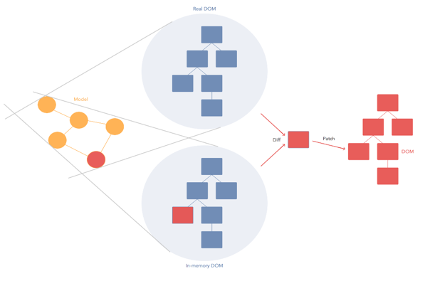

### 框架

1. `AngularJS`， `ReactJS`，`VueJS`各有什么优缺点，适用什么样的开发场景？

  答案：未来的前端是个什么样子的？即响应式Responsive、实时Real-time和活性Reactive。
  Responsive:响应式网页设计(Responsive Web design,缩写RWD),是一种网页设计的技术做法，改设计可使网站在多种设备(从桌面到触摸屏移动设备)上阅读和导航，同时减少缩放、平移和滚动。
  Real-time：考虑到通询技术，如webSocket、E-polling等等，这些需要框架给出对应的模型层或服务层基于支持；
  Reactive：必须考虑到组件的实时刷新原理、方法，这些刷新还不能影响用户操作。

  `AngularJS`， `ReactJS`，`VueJS`这三个库功能上基本都兼容了响应式网站的需求，数据绑定、DOM刷新等机制也可以很好的满足实时性的需求。

  `AngularJS`：

  优点:AngularJS的数据双向绑定、前端模板及针对业务service、factory之类的概念也非常好用，能够帮助开发者很快开发出单页面应用并抛弃JQuery。适合构建需针对数据操作的应用(如网站后台)。多页面快速开发，组件化程度比较低的

  缺点：AngularJS的模板对开发来说并不是非常好用的，整合第三方JQuery插件也会遇到非常多的怪癖，前段Route的开发模式对很多项目冲击也很大，简单来说，并不太适合那些需要开发mozart页面功能的应用(如富文本编辑器、播放器)。

  `ReactJS`

  优点：ReactJS的JSX、虚拟DOM使得界面构建变得非常简答，单项数据流也可以很好的区分开界面的数据作用域问题，和Angular最大的不同是ReactJS基本没有用于业务逻辑的内置特性。规划出了componentDidMount componentWillUnmount等组件的生命周期也让JQuery等库的代码引入变得方便。单页面应用比如聊天软件，后台管理系统

  缺点：ReactJS的单项数据流使的组件间的数据共享规划变得复杂，比如当你想要通过点击一个按钮，并对多处组件进行通知时，就要使用Event机制。然而Event机制针对业务逻辑进行描述时就会变得非常复杂，这一点ReactJS的service方式就会变得方便很多，ReactJS没有这样的机制，因此需要自己实现。
  另外JSX的引入也使得ReactJS并适合直接拷贝min.js到项目中进行使用，抛弃JSX来编写虚拟DOM的话，简直是一种折磨。然而利用Glup之类的工具就会增加前段开发的工作流程，并影响最后的前端打包和发布。

  `VueJS`

  优点：VueJS仿佛是把双向绑定与R的组件化盖帘结合在一起的产物，只包含了数据绑定和DOM操作。对比Angular和React来说轻便了不少，也更容易理解了一些，和React相同的地方是没有用于业务逻辑的内置特性。

  缺点：刚出不久。

  1. 数据流（数据绑定）

      Angular 使用双向绑定即：界面的操作能实时反映到数据，数据的变更能实时展现到界面。

      实现原理：

      $scope变量中使用脏值检查来实现。像ember.js是基于setter，getter的观测机制，$scope.$watch函数，监视一个变量的变化。函数有三参数，”要观察什么”，”在变化时要发生什么”,以及你要监视的是一个变量还是一个对象。使用ng-model时，你可以使用双向数据绑定。 使用$scope.$watch（视图到模型）以及$scope.$apply（模型到视图），还有$scope.$digest。调用$scope.$watch时只为它传递了一个参数，无论作用域中的什么东西发生了变化，这个函数都会被调用。在ng-model中，这个函数被用来检查模型和视图有没有同步，如果没有同步，它将会使用新值来更新模型数据。

      双向绑定的三个重要方法：$scope.$apply()、$scope.$digest()、$scope.$watch()

      在AngularJS双向绑定中，有2个很重要的概念叫做dirty check，digest loop，dirty check（脏检测）是用来检查绑定的scope中的对象的状态的，例如，在js里创建了一个对象，并且把这个对象绑定在scope下，这样这个对象就处于digest loop中，loop通过遍历这些对象来发现他们是否改变，如果改变就会调用相应的处理方法来实现双向绑定

      Vue 也支持双向绑定，默认为单向绑定，数据从父组件单向传给子组件。在大型应用中使用单向绑定让数据流易于理解。

      脏检测的利弊

      和ember.js等技术的getter/setter观测机制相比（优）：
      getter/setter当每次对DOM产生变更，它都要修改DOM树的结构，性能影响大，Angular会把批量操作延时到一次更新，性能相对较好。

      和Vue相比（劣）：

      Vue.js 有更好的性能，并且非常非常容易优化，因为它不使用脏检查。Angular，当 watcher 越来越多时会变得越来越慢，因为作用域内的每一次变化，所有 watcher 都要重新计算。并且，如果一些 watcher 触发另一个更新，脏检查循环（digest cycle）可能要运行多次。 Angular 用户常常要使用深奥的技术，以解决脏检查循环的问题。有时没有简单的办法来优化有大量 watcher 的作用域。Vue.js 则根本没有这个问题，因为它使用基于依赖追踪的观察系统并且异步列队更新，所有的数据变化都是独立地触发，除非它们之间有明确的依赖关系。唯一需要做的优化是在 v-for 上使用 track-by。

      React-单向数据流

      MVVM流的Angular和Vue，都是通过类似模板的语法，描述界面状态与数据的绑定关系，然后通过内部转换，把这个结构建立起来，当界面发生变化的时候，按照配置规则去更新相应的数据，然后，再根据配置好的规则去，从数据更新界面状态。React推崇的是函数式编程和单向数据流：给定原始界面（或数据），施加一个变化，就能推导出另外一个状态（界面或者数据的更新）。React和Vue都可以配合Redux来管理状态数据。

  2. 视图渲染

      Angular1

      AngularJS的工作原理是:HTML模板将会被浏览器解析到DOM中, DOM结构成为AngularJS编译器的输入。AngularJS将会遍历DOM模板, 来生成相应的NG指令,所有的指令都负责针对view(即HTML中的ng-model)来设置数据绑定。因此, NG框架是在DOM加载完成之后, 才开始起作用的。

      React

      React 的渲染建立在 Virtual DOM 上——一种在内存中描述 DOM 树状态的数据结构。当状态发生变化时，React 重新渲染 Virtual DOM，比较计算之后给真实 DOM 打补丁。Virtual DOM 提供了函数式的方法描述视图，它不使用数据观察机制，每次更新都会重新渲染整个应用，因此从定义上保证了视图与数据的同步。它也开辟了 JavaScript 同构应用的可能性。在超大量数据的首屏渲染速度上，React 有一定优势，因为 Vue 的渲染机制启动时候要做的工作比较多，而且 React 支持服务端渲染。

      React 的 Virtual DOM 也需要优化。复杂的应用里可以选择 1. 手动添加 shouldComponentUpdate 来避免不需要的 vdom re-render；2. Components 尽可能都用 pureRenderMixin，然后采用 Flux 结构 + Immutable.js。其实也不是那么简单的。相比之下，Vue 由于采用依赖追踪，默认就是优化状态：动了多少数据，就触发多少更新，不多也不少。

      React 和 Angular 2 都有服务端渲染和原生渲染的功能。

      Vue.js 不使用 Virtual DOM 而是使用真实 DOM 作为模板，数据绑定到真实节点。Vue.js 的应用环境必须提供 DOM。Vue.js 有时性能会比 React 好**，而且几乎不用手工优化。

  3. 性能与优化

      性能方面，这几个主流框架都应该可以轻松应付大部分常见场景的性能需求，区别在于可优化性和优化对于开发体验的影响。Vue 的话需要加好 track-by 。React 需要 shouldComponentUpdate 或者全面 Immutable，Angular 2 需要手动指定 change detection strategy。从整体趋势上来说，浏览器和手机还会越变越快，框架本身的渲染性能在整个前端性能优化体系中，会渐渐淡化，更多的优化点还是在构建方式、缓存、图片加载、网络链路、HTTP/2 等方面。

  4. 模块化与组件化

      Angular1 -> Angular2

      Angular1使用依赖注入来解决模块之间的依赖问题，模块几乎都依赖于注入容器以及其他相关功能。不是异步加载的，根据依赖列出第一次加载所需的所有依赖。可以配合类似于Require.js来实现异步加载，懒加载（按需加载）则是借助于 ocLazyLoad 方式的解决方案，但是理想情况下应该是本地框架会更易懂。Angular2使用ES6的module来定义模块，也考虑了动态加载的需求。

      Vue

      Vue中指令和组件分得更清晰。指令只封装 DOM 操作，而组件代表一个自给自足的独立单元 —— 有自己的视图和数据逻辑**。在 Angular1 中两者有不少相混的地方。

      React

      一个 React 应用就是构建在 React 组件之上的。 组件有两个核心概念：props,state。 一个组件就是通过这两个属性的值在 render 方法里面生成这个组件对应的 HTML 结构。

      传统的 MVC 是将模板放在其他地方，比如 script 标签或者模板文件，再在 JS 中通过某种手段引用模板。按这种思路，想想多少次我们面对四处分散的模板片段不知所措？纠结模板引擎，纠结模板存放位置，纠结如何引用模板。React 认为组件才是王道，而组件是和模板紧密关联的，组件模板和组件逻辑分离让问题复杂化了。所以就有了 JSX 这种语法，就是为了把 HTML 模板直接嵌入到 JS 代码里面，这样就做到了模板和组件关联，但是 JS 不支持这种包含 HTML 的语法，所以需要通过工具将 JSX 编译输出成 JS 代码才能使用（可以进行跨平台开发的依据，通过不同的解释器解释成不同平台上运行的代码，由此可以有RN和React开发桌面客户端）。

  5. 语法与代码风格

      React,Vue,Angular2都支持ES6，Angular2官方拥抱了TypeScript这种 JavaScript 风格。

      React 以 JavaScript 为中心，Angular 2 依然保留以 HTML 为中心。Angular 2 将 “JS” 嵌入 HTML。React 将 “HTML” 嵌入 JS。Angular 2 沿用了 Angular 1 试图让 HTML 更强大的方式。

      React 推荐的做法是 JSX + inline style，也就是把 HTML 和 CSS 全都整进 JavaScript 了。Vue 的默认 API 是以简单易上手为目标，但是进阶之后推荐的是使用 webpack + vue-loader 的单文件组件格式（template,script,style写在一个vue文件里作为一个组件）
  参考：

    - [Angular React 和 Vue的比较](http://blog.csdn.net/haoshidai/article/details/52346865)

2. `React`组件的生命周期。

  答案：组件并不是真实的 DOM 节点，而是存在于内存之中的一种数据结构，叫做虚拟 DOM （virtual DOM）。只有当它插入文档以后，才会变成真实的 DOM 。根据 React 的设计，所有的 DOM 变动，都先在虚拟 DOM 上发生，然后再将实际发生变动的部分，反映在真实 DOM上，这种算法叫做 DOM diff ，它可以极大提高网页的性能表现。

  组件的生命周期分成三个状态：
  * Mounting：已插入真实 DOM
  * Updating：正在被重新渲染
  * Unmounting：已移出真实 DOM
  React 为每个状态都提供了两种处理函数，will 函数在进入状态之前调用，did 函数在进入状态之后调用，三种状态共计五种处理函数。
  * componentWillMount()
  * componentDidMount()
  * componentWillUpdate(object nextProps, object nextState)
  * componentDidUpdate(object prevProps, object prevState)
  * componentWillUnmount()
  此外，React 还提供两种特殊状态的处理函数。
  * componentWillReceiveProps(object nextProps)：已加载组件收到新的参数时调用
  * shouldComponentUpdate(object nextProps, object nextState)：组件判断是否重新渲染时调用
  ```JS
  var Hello = React.createClass({
    getInitialState: function () {
      return {
        opacity: 1.0
      };
    },

    componentDidMount: function () {
      this.timer = setInterval(function () {
        var opacity = this.state.opacity;
        opacity -= .05;
        if (opacity < 0.1) {
          opacity = 1.0;
        }
        this.setState({
          opacity: opacity
        });
      }.bind(this), 100);
    },

    render: function () {
      return (
        <div style={{opacity: this.state.opacity}}>
          Hello {this.props.name}
        </div>
      );
    }
  });

  ReactDOM.render(
    <Hello name="world"/>,
    document.body
  );
  ```
  上面代码在hello组件加载以后，通过 componentDidMount 方法设置一个定时器，每隔100毫秒，就重新设置组件的透明度，从而引发重新渲染。另外，组件的style属性的设置方式也值得注意，不能写成`style="opacity:{this.state.opacity};"`,而要写成`style={{opacity: this.state.opacity}}`这是因为 React 组件样式是一个对象，所以第一重大括号表示这是 JavaScript 语法，第二重大括号表示样式对象。
  参考：

    - [React 入门实例教程](http://www.ruanyifeng.com/blog/2015/03/react.html)

3. `React` 渲染网页的流程。

  答案：
  将当前DOM存一份在内存中，由虚拟DOM来确保只对界面上真正发生变化的部分进行实际的DOM操作。所有的 DOM 变动，都先在虚拟 DOM 上发生，然后再将实际发生变动的部分，反映在真实 DOM上。

4. `React`的 `DOM-DIFF`算法的原理

  答案：虚拟DOM的核心思想就是通过计算新旧页面之间的差异，然后将这些差异应用到旧的页面上，所以它主要由三个部分组成：

  1) 用JS模拟真实的DOM。

  2) 对比两棵虚拟DOM树之间的差异。

  3) 将差异应用到旧的页面上。

  整个DOM-Diff的流程概括为：当页面状态发生变化时，重新构造一棵新的JS对象树，用新的对象树和旧的对象树进行比较，利用DOM-Diff算法，记录两棵对象树的差异。大部分页面变更前和变更后DOM树的结构基本相似，且很少会有跨层级DOM元素移动，所以可以舍弃很多复杂的移位比较。两点假设：

  1) 只对树中同层级的节点进行差异对比，而对于不同层级的节点仅进行创建或删除操作。当发现某个节点在新的树中已被删除，那么其所有的子节点也会被一同删掉，不会再递归进行子节点的差异比较。算法复杂度由此降为O(n)。

  2) 对于同一层的一组子节点，可以通过唯一的Key值进行区分定位，在对列表进行添加和删除操作时，只需要给出新的列表元素的顺序，就可以有效地复用DOM元素。

  1. 在实际的代码中，会对新旧两棵树进行一个深度优先的遍历，这样每个节点都会有一个唯一的标记：
  2. 在深度优先遍历的时候，每遍历到一个节点就把该节点和新的的树进行对比。如果有差异的话就记录到一个对象里面。。
  3. 通过深度优先遍历两棵树，每层的节点进行对比，记录下每个节点的差异了。因为foreach是孩子节点没有孙子。

5. `Redux`是干什么的？

  答案：React 只是 DOM 的一个抽象层，并不是 Web 应用的完整解决方案。也就是说，只用 React 没法写大型应用。为了解决这个问题，Redux 出现，将 Flux 与函数式编程结合一起。Redux 是一个有用的架构，是为 Javascript 应用而生的可预估的状态容器，一个状态管理工具。Redux 的适用场景：多交互、多数据源。
  用户的使用方式复杂
  * 不同身份的用户有不同的使用方式（比如普通用户和管理员）
  * 多个用户之间可以协作
  * 与服务器大量交互，或者使用了WebSocket
  * View要从多个来源获取数据
  * 某个组件的状态，需要共享
  * 某个状态需要在任何地方都可以拿到
  * 一个组件需要改变全局状态
  * 一个组件需要改变另一个组件的状态
  发生上面情况时，如果不使用 Redux 或者其他状态管理工具，不按照一定规律处理状态的读写，代码很快就会变成一团乱麻。你需要一种机制，可以在同一个地方查询状态、改变状态、传播状态的变化。

  Redux 的设计思想很简单，就两句话。

    * Web 应用是一个状态机，视图与状态是一一对应的。
    * 所有的状态，保存在一个对象里面。

  参考：

    - [Redux 入门教程（一）：基本用法](http://www.ruanyifeng.com/blog/2016/09/redux_tutorial_part_one_basic_usages.html)

6. `Redux`的三大原是什么？

  答案：
  1. 单一的 store

    区别于 flux 模式中可以有多个 state，整个应用的数据以树状结构存放在一个 state 对象中。
    ```js
    console.log(store.getState())
    /* Prints
    {
      visibilityFilter: 'SHOW_ALL',
      todos: [
        {
          text: 'Consider using Redux',
          completed: true,
        },
        {
          text: 'Keep all state in a single tree',
          completed: false
        }
      ]
    }
    */
    ```
  2. state 只读

    state 包含的应用数据不能随意修改，修改数据的唯一方式是 dispatch action，action 描述要修改的信息(这和 flux 架构上是一致的，不过在设计上更加严格，见后面的 reducer 设计)。
    ```js
    store.dispatch({
      type: 'COMPLETE_TODO',
      index: 1
    })

    store.dispatch({
      type: 'SET_VISIBILITY_FILTER',
      filter: 'SHOW_COMPLETED'
    })
    ```
  3. 数据的改变由纯函数生成

    在 redux 中，应用数据的改变路径为:

      * store.dispatch(action)
      * newState = reducer(previousState, action)
      * reducer 为纯函数:纯函数是函数是编程的思想，只要参数相同，函数返回的结果永远是一致的，并且不会对外部有任何影响（不会改变参数对象的数据）。也就是说 reducer 每次必须返回一个新状态，新状态由旧状态和 action 数据决定。

    参考：

      - [redux 入门介绍](https://zhuanlan.zhihu.com/p/21337964?refer=leanreact)
