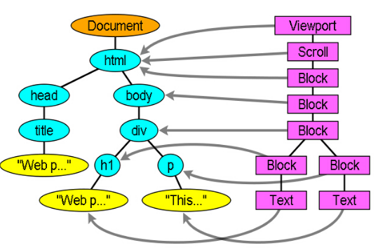

## 综合性问题
1. 一个页面从输入 URL 到页面加载完的过程中都发生了什么事情？

  答案：假设一个非常粗糙的简化模型，尽可能简单的HTTP请求，没有Proxy，IPv4(互联网协议（Internet Protocol，IP）的第四版，也是第一个被广泛使用，构成现今互联网技术的基石的协议):
  1. 浏览器检查缓存：如果请求的对象缓存了，而且新鲜，跳到# 9；
  2. 浏览器向OS(Operating System,操作系统)询问服务器的IP地址；
  3. 操作系统使用DNS查找，根据域名寻找IP地址，并且将查找到的IP地址回复给浏览器；
  4. 浏览器打开一个TCP连接到服务器（HTTPS这一步是非常复杂）；
  5. 浏览器通过TCP连接发送HTTP请求；
  6. 浏览器接收HTTP响应，有可能关闭TCP连接，也有可能重用它发送另一个请求；
  7. 浏览器检查响应，如果服务器段返回以301之类的重定向，浏览器根据相应头中的location再次发送请求，错误（4xx和5XX），等等；这些不同于正常的响应处理（2xx）。
  8. 如果设置了可以缓存，将响应存储在缓存中；
  9. 浏览器解压响应（服务器端接受请求，处理请求生成html代码，返回给浏览器，这时的html页面代码可能是经过压缩的）
  10. 浏览器决定如何响应（例如，它是一个HTML网页，它是一个图像，它是一个声音片段？）
  11. 浏览器呈现响应，或为无法识别的类型提供下载对话框.

  同样，讨论的这些内容都在无数的页面中出现，仅作为一个简短的总结。此外，还有很多其他的事情并发在这个过程中(processing typed-in address, speculative prefetching, adding page to browser history, displaying progress to user, notifying plugins and extensions, rendering the page while it's downloading, pipelining, connection tracking for keep-alive, checking for malicious content etc.) 和整个操作得到的幅度更复杂的命令（HTTPS证书和密码和钉扎，我的天啊！）。

  参考：

    - [stackoverflow的答案](http://stackoverflow.com/questions/2092527/what-happens-when-you-type-in-a-url-in-browser)

2. `html`页面的渲染过程

  答案：渲染该过程主要分为以下步骤：解析HTML、构建DOM树、DOM树与CSS样式进行附着构造渲染树、 布局、绘制。  
  1. 解析与构建DOM树

    对于HTML浏览器有专门的html解析器来解析HTML，并在解析的过程中构建DOM树。在这里我们讨论两种DOM元素的解析，即样式（link、style）与脚本文件（script）。由于浏览器采用自上而下的方式解析，在遇到这两种元素时都会阻塞浏览器的解析，直到外部资源加载并解析或执行完毕后才会继续向下解析html。对于样式与脚本的先后顺序同样也会影响到浏览器的解析过程，究其原因主要在于：script脚本执行过程中可能会修改html界面（如document.write函数）；DOM节点的CSS样式会影响js的执行结果。

    * 外部样式会阻塞后续脚本执行，直到外部样式加载并解析完毕。
    * 外部样式不会阻塞后续外部脚本的加载，但会阻塞外部脚本的执行。外部脚本与外部样式是并行加载，但直到外部样式加载完毕，外部脚本才开始执行；并行加载，同步执行。
    * 如果后续外部脚本含有async属性（IE下为defer），则外部样式不会阻塞该脚本的加载与执行；
    * 对于动态创建的link标签不会阻塞其后动态创建的script的加载与执行，不管script标签是否具有async属性，但对于其他非动态创建的script，以上三条结论仍适用。

    html解析完毕，DOM树创建完成后DOMContentLoaded事件即触发，这时候可以用过script来操作DOM节点。(
    1. 解析HTML结构。
    2. 加载外部脚本、样式表文件。(放最后，或者设置 async、defer)
    3. 解析并执行脚本代码。
    4. DOM树构建完成。//DOMContentLoaded
    5. 加载图片等外部文件。
    6. 页面加载完毕。//load
    在第4步，会触发DOMContentLoaded事件。在第6步，触发load事件。)
  2. 构建渲染树

    HTML解析完毕后，开始构建渲染树RenderTree，这一步的主要工作在于将css样式应用到DOM节点上，WebKit内核将这一过程称为附着，其他浏览器有不同的概念。对前端工程师而言这个过程会涉及到CSS层叠问题。首先将根据样式重要性排序，由低到高依次为：浏览器声明、用户普通声明、作者普通声明、作者重要声明、用户重要声明；对于同一重要级别，则是根据CSS选择符的特指度来判定优先级；一条样式声明的特指度由以下四个部分决定：S-I-C-E：声明来自内联的style属性则 S+1；声明中含有id属性则 I+1；声明中含有类、伪类、属性选择器则 C+1；声明中含有元素、伪元素选择器则 E+1；特指度的比较类似于两个字符串之间比较大小。渲染树的每一个节点即为与其相对应的DOM节点的CSS框，框的类型与DOM节点的display属性有关，block元素生成block框，inline元素生成inline框。每一个渲染树节点都有与之相对应的DOM节点，但DOM节点不一定有与之相对应的渲染树节点，比如display属性为none的DOM节点，而且渲染树节点在渲染树中的位置与他们在DOM树中的位置不一定相同，比如float与绝对定位元素。下图为渲染树与其相对应的DOM树节点

    
  3. 布局

    渲染树构造完成后浏览器便进行布局处理，及计算每个渲染树节点的大小和位置信息。有道友可能要问，前面已将样式附着到DOM节点上，不是已经有了样式信息为何还要计算大小。这里可以这样理解，以上包含大小的样式信息只是存在内存里，并没有实际使用，浏览器要根据窗口的实际大小来处理渲染树节点的实际显示大小和位置，比如对于margin为auto的处理。布局是一个递归过程，从根呈现节点开始，递归遍历子节点，计算集合几何信息。
  4. 绘制

    布局完成后，便是将渲染树绘制出来显示在屏幕上。对于每一个渲染树节点来说，主要绘制顺序如下：背景颜色；背景图片；边框；子渲染树节点；轮廓

  参考：

    - [HTML渲染过程详解](http://www.cnblogs.com/dojo-lzz/p/3983335.html)

3. 你是如何了解到并且学习一门技术的？

  答案：

  参考：

    - 

4. 你平时是如何学习前端的？

   前端技术发展很快, 工具层出不穷, 它们往往以低廉的代价专注于某个问题域给出了当时合理的解决方案, 在短时间内成为主流, 但往往由于标准的推进, 前端问题域的变化, 落后于更好的解决方案, 迅速过时.
   这启发我对于学习前端, 始终坚持这样一种策略:

   对新生工具和技术, 防御性地跟进了解, 作为技术储备
   对主流的解决方案, 分析调研目前的需求, 快速使用, 作为开发技能
   对过时的流行方案, 观察当时出现的背景和对应的问题域, 研究其核心思想, 作为分析参考

5. 你未来三年的计划

  答案：

  参考：

    - 

6. 讲一下你读过的和正在读或者研究的关于前端技术的书或者技术。

  答案：

  参考：

    - 

7. 你对前端的理解？你为什么学前端？

  答案：

  参考：

    - 

8. “渐进增强”和“优雅降级”指的是什么？

  答案：之前在看一些css3效果demo的时候，发现有些写css3属性时，兼容性的写法顺序不太一样。优雅降级和渐进增强印象中是随着css3流出来的一个概念。由于低级浏览器不支持css3，但css3的效果又太优秀不忍放弃，所以在高级浏览中使用css3而低级浏览器只保证最基本的功能。咋一看两个概念差不多，都是在关注不同浏览器下的不同体验，关键的区别是他们所侧重的内容，以及这种不同造成的工作流程的差异。

  渐进增强 progressive enhancement：针对低版本浏览器进行构建页面，保证最基本的功能，然后再针对高级浏览器进行效果、交互等改进和追加功能达到更好的用户体验。

  优雅降级 graceful degradation：一开始就构建完整的功能，然后再针对低版本浏览器进行兼容。

  区别：优雅降级是从复杂的现状开始，并试图减少用户体验的供给，而渐进增强则是从一个非常基础的，能够起作用的版本开始，并不断扩充，以适应未来环境的需要。降级（功能衰减）意味着往回看；而渐进增强则意味着朝前看，同时保证其根基处于安全地带。

  “优雅降级”观点：认为应该针对那些最高级、最完善的浏览器来设计网站。而将那些被认为“过时”或有功能缺失的浏览器下的测试工作安排在开发周期的最后阶段，并把测试对象限定为主流浏览器（如 IE、Mozilla 等）的前一个版本。在这种设计范例下，旧版的浏览器被认为仅能提供“简陋却无妨 (poor, but passable)” 的浏览体验。你可以做一些小的调整来适应某个特定的浏览器。但由于它们并非我们所关注的焦点，因此除了修复较大的错误之外，其它的差异将被直接忽略。

  “渐进增强”观点：认为应关注于内容本身。内容是我们建立网站的诱因。有的网站展示它，有的则收集它，有的寻求，有的操作，还有的网站甚至会包含以上的种种，但相同点是它们全都涉及到内容。这使得“渐进增强”成为一种更为合理的设计范例。这也是它立即被 Yahoo! 所采纳并用以构建其“分级式浏览器支持 (Graded Browser Support)”策略的原因所在。

  参考：

    - [优雅降级和渐进增强的区别](http://www.cnblogs.com/mofish/p/3822879.html)

9. 什么是“FOUC”及如何避免

  答案：今天了解了一个新的名词叫做 FOUC 浏览器样式闪烁，之前也听说过一些类似的东西，比如样式突变等等，但这东西竟然有学名的。。什么是FOUC(文档样式短暂失效)?如果使用import方法对CSS进行导入,会导致某些页面在Windows 下的Internet Explorer出现一些奇怪的现象:以无样式显示页面内容的瞬间闪烁,这种现象称之为文档样式短暂失效(Flash of Unstyled Content),简称为FOUC。

  原因大致为：
  1. 使用import方法导入样式表。
  2. 将样式表放在页面底部
  3. 有几个样式表，放在html结构的不同位置。

  其实原理很清楚：当样式表晚于结构性html加载，当加载到此样式表时，页面将停止之前的渲染。此样式表被下载和解析后，将重新渲染页面，也就出现了短暂的花屏现象。

  解决方法：使用LINK标签将样式表放在文档HEAD中。

  参考：

    - [什么是FOUC？如何避免FOUC？](http://blog.csdn.net/kongtoubudui/article/details/12975401)

10. 什么是面向对象编程及面向过程编程，它们的异同和优缺点？

  答案：

  参考：

    - 

11. 面向对象的三大原则是什么？

  答案：

  参考：

    - 

12. 你在平时的学习和工作中有遇到过什么问题，你是如何解决的？

  答案：

  参考：

    - 

13. 对于现在前端发展日新月异，各种框架层出不穷，你是怎么看待的？

   提示：围绕基础最重要，不要盲目更新，适合项目需求才是最好的。

14. 进程与线程的联系和区别

  答案：进程：程序的一次执行，可理解为一个容器；线程：CPU的基本调度单位，也可理解为容器中的工作单位。
  联系：一个程序至少有一个进程,一个进程至少有一个线程，线程是进程的一部分；进程可以包含多个线程来并发运行；线程利用的资源（比如内存）是共享进程的。
  区别：地址空间和其它资源不同，进程间相互独立，同一进程的各线程间共享；通信不同，进程间通信IPC（internet process connection），线程间可以直接读写进程数据段（如全局变量）来进行通信——需要进程同步和互斥手段的辅助，以保证数据的一致性；调度和切换不同，线程上下文切换比进程上下文切换要快得多。
  参考：进程与线程的一个简单解释

15. 性能优化的核心指标

  答案：
  核心性能定义介绍：

  由于涉及前后端的性能指标、定义非常多，本文将重点介绍对前后端影响比较大的指标，让大家对性能优化的核心指标有个整体的认识与了解

  后端性能定义

  * DNS时间：用户在浏览器输入网址名称（网址）后，浏览器通过查询DNS服务器所需要的时间
  * 建立连接时间：根据TCP协议要求，请求方（浏览器等）与接受方（服务器）经过一系列协商所需要的时间
  * 服务器处理时间：接收方（服务器）处理请求所需时间
  * 数据传输时间：从请求方（浏览器等）到接收方（服务器）以及从接收方（服务器）到请求方的时间
  前端性能定义：
  * 白屏时间：用户浏览器输入网址后至浏览器出现至少1px图片为止；从用户进入网站（输入url、刷新、跳转等方式）的时刻开始计算，一直到页面有内容展示出来的时间节点。这个过程包括dns查询、建立tcp连接、发送首个http请求（如果使用https还要介入TLS的验证时间）、返回html文档、html文档head解析完毕。
  * 首屏时间：用户浏览器首屏内所有的元素呈现所花费时间
  * 用户可操作时间(dom ready) ：网站某些功能可以使用的时间
  * 页面总下载时间(onload):网站中所有资源加载完成并且可用时间
  影响核心性能因素：
  * DNS时间：与DNS设置的TTL时间以及DNS服务器有关
  * 建立连接时间：与用户、服务器的网速、带宽有关
  * 服务器起处理时间：与程序复杂度、服务器性能相关
  * 数据传输时间：资源大小、用户、服务器的网速、带宽有关
  * 白屏时间：与后端性能指标、前端headtime以及页面结构设计
  * 首屏时间：与白屏时间以及页面首屏程序设计有关
  * 用户可操作时间：与页面结构设计相关
  * 页面总下载时间: 与页面资源多少相关
