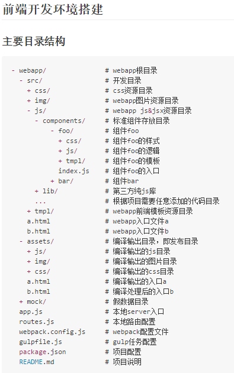

### 自动化工具

1. `gulp` 和`grunt`的区别(前端工程的构建工具对比)

  答案：Gruntfile.js
  ```js
  module.exports = function(grunt) {
      grunt.initConfig({
          concat: {
              'dist/all.js': ['src/*.js']
          },
          uglify: {
              'dist/all.min.js': ['dist/all.js']
          },
          jshint: {
              files: ['gruntfile.js', 'src/*.js']
          },
          watch: {
              files: ['gruntfile.js', 'src/*.js'],
              tasks: ['jshint', 'concat', 'uglify']
          }
      });

      // Load Our Plugins
      grunt.loadNpmTasks('grunt-contrib-jshint');
      grunt.loadNpmTasks('grunt-contrib-concat');
      grunt.loadNpmTasks('grunt-contrib-uglify');
      grunt.loadNpmTasks('grunt-contrib-watch');

      // Register Default Task
      grunt.registerTask('default', ['jshint', 'concat', 'uglify']);
  };
  ```
  Gulpfile.js
  ```js
  var gulp = require('gulp');
  var jshint = require('gulp-jshint');
  var concat = require('gulp-concat');
  var rename = require('gulp-rename');
  var uglify = require('gulp-uglify');

  // Lint JS
  gulp.task('lint', function() {
      return gulp.src('src/*.js')
          .pipe(jshint())
          .pipe(jshint.reporter('default'));
  });

  // Concat & Minify JS
  gulp.task('minify', function(){
      return gulp.src('src/*.js')
          .pipe(concat('all.js'))
          .pipe(gulp.dest('dist'))
          .pipe(rename('all.min.js'))
          .pipe(uglify())
          .pipe(gulp.dest('dist'));
  });

  // Watch Our Files
  gulp.task('watch', function() {
      gulp.watch('src/*.js', ['lint', 'minify']);
  });

  // Default
  gulp.task('default', ['lint', 'minify', 'watch']);
  ```
  Grunt.js是基于Node.js的自动化任务运行器,Grunt有一个完善的社区，插件丰富,它简单易学，你可以随便安装插件并配置它们。

  Glup：流：Gulp是一个基于流的构建系统，使用代码优于配置的策略；插件：Gulp的插件更纯粹，单一的功能，并坚持一个插件只做一件事；代码优于配置：维护Gulp更像是写代码，而且Gulp遵循CommonJS规范，因此跟写Node程序没有差别。

  Gulp和Grunt的异同点

  * 易于使用：Gulp相比Grunt更简洁，而且遵循代码优于配置策略，维护Gulp更像是写代码。Gulp让简单的事情继续简单，复杂的任务变得可管理。
  * 高效：Gulp相比Grunt更有设计感，核心设计基于Unix流的概念，利用Node.js强大的流，不需要往磁盘写中间文件，通过管道连接,可以更快地完成构建。使用Grunt的I/O过程中会产生一些中间态的临时文件，一些任务生成临时文件，其它任务可能会基于临时文件再做处理并生成最终的构建后文件。而使用Gulp的优势就是利用流的方式进行文件的处理，通过管道将多个任务和操作连接起来，因此只有一次I/O的过程，流程更清晰，更纯粹，没有产生中间文件。I/O流程的不同。
  * 高质量：Gulp的每个插件只完成一个功能，这也是Unix的设计原则之一，各个功能通过流进行整合并完成复杂的任务。例如：Grunt的imagemin插件不仅压缩图片，同时还包括缓存功能。他表示，在Gulp中，缓存是另一个插件，可以被别的插件使用，这样就促进了插件的可重用性。
  * 易于学习：通过把API降到最少，Gulp的核心API只有5个，掌握了5个API就学会了Gulp，之后便可以通过管道流组合自己想要的任务。构建工作就像你设想的一样：是一系列流管道。

  Gulp的核心：流
  Gulp通过流和代码优于配置策略来尽量简化任务编写的工作。这看起来有点“像jQuery”的方法，把动作串起来创建构建任务。Node将几乎所有IO操作都抽象成了Stream的操作。因此用Gulp编写任务也可看作是用Node.js编写任务。当使用流时，Gulp去除了中间文件，只将最后的输出写入磁盘，整个过程因此变得更快。

  Gulp的API

  * gulp.task
  * gulp.run
  * gulp.watch
  * gulp.src
  * gulp.dest

  gulp.task中，解决上述任务依赖的方式有三种：

  * 在任务定义的function中返回一个数据流，当该数据流的end事件触发时，任务结束。
  * 在任务定义的function中返回一个promise对象，当该promise对象resolve时，任务结束。
  * 在任务定义的function中传入callback变量，当callback()执行时，任务结束。
  Gulp脚本中可以使用这三种方法来实现任务依赖，不过由于Gulp中的任务大多是数据流操作，因此以第一种方法为主。

  为什么应该使用流？

  Node中的I/O操作是异步的，因此磁盘的读写和网络操作都需要传递回调函数。
  ```js
  var http = require('http');
  var fs = require('fs');

  var server = http.createServer(function (req, res) {
          fs.readFile(__dirname + '/data.txt', function (err, data) {
                  res.end(data);
          });
  });
  server.listen(8000);
  ```
  这个Node.js应用很简单，估计所有学习过Node的人都做过这样的练习，可以说是Node的Hello World了。这段代码没有任何问题，你使用node可以正常的运行起来，使用浏览器或者其他的http客户端都可以正常的访问运行程序主机的8000端口读取主机上的data.txt文件。但是这种方式隐含了一个潜在的问题，node会把整个data.txt文件都缓存到内存中以便响应客户端的请求（request），随着客户端请求的增加内存的消耗将是非常惊人的，而且客户端需要等待很长传输时间才能得到结果。让我们再看一看另外一种方式，使用流：
  ```js
  var http = require('http');
  var fs = require('fs');

  var server = http.createServer(function (req, res) {
          var stream = fs.createReadStream(__dirname + '/data.txt');
          stream.pipe(res);
  });
  server.listen(8000);
  ```
  这里面有一个非常大的变化就是使用createReadStream这个fs的方法创建了stream这个变量，并由这个变量的pip方法来响应客户端的请求。使用stream这个变量就可以让node读取data.txt一定量的时候就开始向客户端发送响应的内容，而无需服务缓存以及客户端的等待。

  参考：

    - [Gulp vs Grunt](https://paulguo.io/blog/tech/2014/09/11/Gulp-vs-Grunt.html)

2. `webpack`打包工具的运行原理

  答案：前端工程化的建设，早期的做法是使用Grunt、Gulp等构建工具。但本质上它们只是一个任务调度器，将功能独立的任务拆解出来，按需组合运行任务。如果要完成前端工程化，这两者配置门槛很高，每一个任务都需要开发者自行使用插件解决，而且对于资源的依赖管理能力太弱。在国内，百度出品的fis也是一种不错的工程化工具的选择，fis内部也解决了资源依赖管理的问题。因笔者没有在项目中实践过fis，所以不进行更多的评价。webpack以一种非常优雅的方式解决了前端资源依赖管理的问题，它在内部已经集成了许多资源依赖处理的细节，但是对于使用者而言只需要做少量的配置，再结合构建工具，很容易搭建一套前端工程解决方案。基于webpack的前端自动化工具，可以自由组合各种开源技术栈（Koa/Express/其他web框架、webpack、Sass/Less/Stylus、Gulp/Grunt等），没有复杂的资源依赖配置，工程结构也相对简单和灵活。

  打包，本质来说就是把许多零散的文件有序的合并成为一个文件，达到前端优化的效果。构建 != 打包，反之亦然；打包可以说是构建的一环，构建可以做更多的事情；但是，打包永远都是构建的一个核心。

  

  Webpack可以让前端开发人员可以像写后端代码一样写前端，充分利用NPM完善的生态，让NPM包也可以利用到前端。Webpack本来只能处理js文件，但是利用不同的loader，可以将不同的文件，比如图片，css等转换为js代码，再交由webpack处理。webpack更像是一个平台，通过可以写loader和插件，实现各种各样不同的需求。

3. `npm script`npm脚本

  答案：npm 允许在package.json文件里面，使用scripts字段定义脚本命令。
  ```js
  {
    // ...
    "scripts": {
      "build": "node build.js"
    }
  }
  ```
  上面代码是package.json文件的一个片段，里面的scripts字段是一个对象。它的每一个属性，对应一段脚本。比如，build命令对应的脚本是node build.js。命令行下使用npm run命令，就可以执行这段脚本。`$ npm run build`等同于执行`node build.js`。

  定义在package.json里面的脚本，就称为 npm 脚本。它的优点很多。
  * 项目的相关脚本，可以集中在一个地方。
  * 不同项目的脚本命令，只要功能相同，就可以有同样的对外接口。用户不需要知道怎么测试你的项目，只要运行npm run test即可。
  * 可以利用 npm 提供的很多辅助功能。
  查看当前项目的所有 npm 脚本命令，可以使用不带任何参数的`npm run`命令。npm 脚本的原理非常简单。每当执行npm run，就会自动新建一个 Shell，在这个 Shell 里面执行指定的脚本命令。因此，只要是 Shell（一般是 Bash）可以运行的命令，就可以写在 npm 脚本里面。

  常用脚本示例
  ```js
  // 删除目录
  "clean": "rimraf dist/*",
  // 本地搭建一个 HTTP 服务
  "serve": "http-server -p 9090 dist/",
  // 打开浏览器
  "open:dev": "opener http://localhost:9090",
  // 实时刷新
   "livereload": "live-reload --port 9091 dist/",
  // 构建 HTML 文件
  "build:html": "jade index.jade > dist/index.html",
  // 只要 CSS 文件有变动，就重新执行构建
  "watch:css": "watch 'npm run build:css' assets/styles/",
  // 只要 HTML 文件有变动，就重新执行构建
  "watch:html": "watch 'npm run build:html' assets/html",
  // 部署到 Amazon S3
  "deploy:prod": "s3-cli sync ./dist/ s3://example-com/prod-site/",
  // 构建 favicon
  "build:favicon": "node scripts/favicon.js",
  ```

  参考：

    - [npm scripts 使用指南](http://www.ruanyifeng.com/blog/2016/10/npm_scripts.html)



这是个经典的前端项目目录结构，项目目结构在一定程度上约定了开发规范。业务开发的同学只需关注src目录即可，开发时尽可能最小化模块粒度，这是异步加载的需要。assets是整个工程的产出，无需关注里边的内容是什么，怎么打包和解决资源依赖的.
